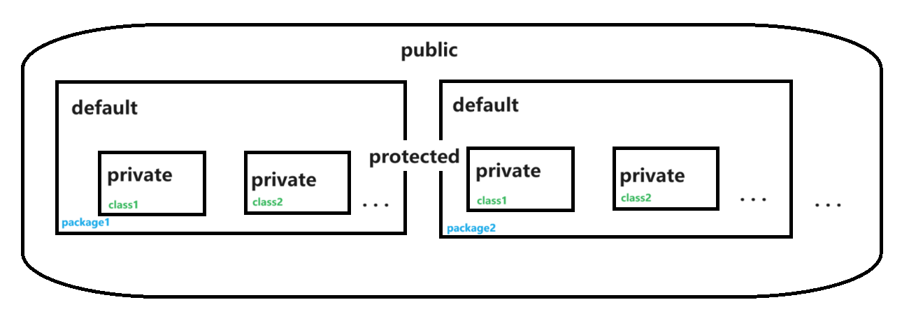

1. 对象数组

对象数组创建方式与整数数组一致，但是由于对象是引用类型，其默认值是null；因此给每一个元素负值时，要么重新实例化一个对象，要么把现有实例化对象赋值给它。

```java
Person[] persons = new Person[n]; 
String[] names = {"张三", "李四", "赵武"};

for (int i = 0; i < persons.length; i++) { // 初始化， 否则会空指针异常
   persons[i] = new Person(names[i]);
}
for (Person person : persons) {
   System.out.println(person.getName());
}
```

2. static修饰符

- 修饰属性（成员变量）：
- - 类成员变量/静态成员变量：使用static修饰的，作用范围在整个类的所有对象上；所有对象共享这个变量，在内存中只有一个副本。访问通过 类名.变量名 访问。在类加载时被初始化，存储在堆里；
  - 实例成员变量：没有static修饰，作用范围在某个实例对象上；在创建对象时被初始化，存在多个副本。各个对象不互相影响。通过 实例对象名.变量名 访问。
- 修饰方法：
- - 类方法或静态方法: 使用static修饰，不能直接使用实例变量，只能直接使用静态变量；只能直接调用静态方法，不能直接调用实例方法；建议通过 类名.方法名() 访问;👍
    - 因为静态变量在加载类的时候就已经初始化了，但是实例变量需要创建对象的时候才实例化，而静态方法只能通过类名调用不需要实例化，不能直接调用实例变量；
    - 同理，静态方法只能直接调用静态方法；
    - 实例变量和实例方法，需要通过创建对象的方式实例化调用。
    - 此外，静态方法中不允许使用 this 关键字，应为 this 关键字指代的是对象实例。:eyes: 🚀️
  - 实例方法: 没有static惨饰，既可以使用静态变量，又可以使用实例变量。既可以直接访问实例方法，又可以直接访问静态方法。通过 实例对象名.方法名() 访问。
- 修饰语句块：😕
- - 执行顺序：静态代码块 > 构造代码块 > 构造方法
  - 静态代码块: 类加载的时候执行，并且只执行一次，优先于各种代码块和构造方法，最开始执行的。
    - > 静态代码块的作用包括：在类被加载到内存时执行一次性的初始化操作，主要用于设置静态变量的初始值或执行类级别的初始化任务。这些任务只在类首次加载时执行，不会随着类实例的创建而重复执行。静态代码块常用于初始化静态变量、管理共享资源、控制类加载顺序以及优化性能等场景。如线程池。
      >
  - 构造代码块（非静态/实例初始化块）: 在创建对象时被调用，每创建一次对象，都会执行一次构造代码块。 执行顺序，优先于构造方法执行。
  - 构造方法：一个类如果有多个构造方法时，每通过构造方法，创建一个对象，代码块都会被执行一次。但是对于构造方法来讲，只执行某一个构造方法(根据参数执行)。

```java
public class Point02_StaticBlock { // 静态代码块测试
    public static void main(String[] args) {
        Student student = new Student(); // 执行顺序： 静态代码块 -> 构造代码块 -> 无参构造函数
        Student student1 = new Student("sb"); // 执行顺序： 静态代码块 -> 构造代码块 -> 有参构造函数
        // 静态代码块只在类加载时执行一次
        // 构造代码块每次创建对象都执行一次
        // 构造方法在每次创建对象都执行相应的构造方法
    }
}

class Student {
    private String name;

    public Student() {
        System.out.println("无参构造函数");
    }

    public Student(String name) {
        this.name = name;
        System.out.println("有参构造函数");
    }

    {
        System.out.println("构造代码块");
    }

    static {
        System.out.println("静态代码块");
    }
}
```

3. 单例模式👍

Singleton Pattern

单例模式: 保证一个类只能创建一个实例对象，自行实例化，并向整个系统提供这个对象。

实现: 构造方法私有

- 饿汉式（不考虑并发）

```java
class HungrySingleton { // 饿汉式，类加载时就创建实例
    // 类加载初始化时就创建实例，并且设为 static，所有实例都拥有。final 设为常量，不可更改
    private static final HungrySingleton hungrySingleton = new HungrySingleton();

    private HungrySingleton() { // 私有化构造函数，不允许外部创建实例
    }

    public static HungrySingleton getInstance(){ // 暴露一个共有方法获取创建的实例
        return hungrySingleton;
    }
}
```

- 懒汉式（不考虑并发）

```java
class LazySingleton { // 懒汉式，创建对象是才判断是否已经创建实例，没有则创建
    private static LazySingleton lazySingleton; // 声明但不创建, 不声明为final，因为还未创建

    private LazySingleton() { // 私有化构造函数，不允许外部创建实例
    }

    public static LazySingleton getInstance() { // 暴露一个共有方法获取创建的实例
        if(lazySingleton==null){
            lazySingleton = new LazySingleton();
        }
        return lazySingleton;
    }
}
```

4. 打包和导包

package 进行打包操作；包的用途：

- 避免命名冲突
- 可以按功能将类进行组合
- 可以保护类、数据和方法
  - 注意问题:
    - package打包语句必须在代码的第一条语句。前面只能有空白和注释；
    - 使用package时，会在磁盘上生成对应的目录；
    - 每个源文件只能有一条打包语向。
- java常用包

> java类库中比较常用的包:
>
> `java.lang`：java语言包 不需要进行导包，就可以使用的, 如System、Math、String；
>
> `java.util`：java实用工具包；
>
> `java.io`：java输入输出流包；
>
> `java.net`：java网络包；
>
> `java.text`：处理文本、日期、时间、数字、消息的类和接口；
>
> `java.swing`：图形用户界面。

在同一个包中，类之间互相访问，可以不需导包操作; 如果类不在同一个包下面，需要使用import进行导包操作。可以导入类，也可以导入类的静态方法。

5. 访问修饰符（封装）👍

类（内部类除外）的访问修饰符只有public和默认；而属性和方法的访问修饰符有：

- private：当前类可访问
- default(默认，什么都不写就是默认)：同一个包可访问
- protected：同一个包或其子类（可以不同包）可以访问
- public：所有都可访问



5. this关键字的使用

- this.属性名：区分全局属性和局部属性（在构造方法中）
- this,方法名()：调用自身的方法
- this([参数])：构造方法之间调用
- this：代表当前对象 static 方法中不能使用this，this指代对象
