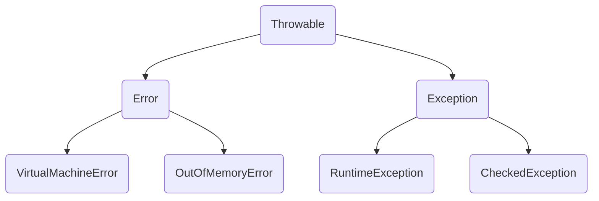

1. 异常

- 编译错误: 基本语法错误，编译器进行语法检查，如果没有通过，程序违背了计算机编程语言的语法；
- 运行错误: 程序可以执行，在执行过程中发生异常，导致程序提前退出，没有得到预计的执行效果；
- 逻辑错误: 程序可以执行，结果不对。

异常体系，保证程序的健壮性。



RuntimeException(运行时异常): 程序运行时抛出，可以通过反复测试尽量避免，不应该靠异常处理机制来解决。

CheckedException(检查型异常): 编译器对代码进行检查，如果没有处理异常，不允许程序通过。🚀️

---

2. 异常处理

0️⃣ 不处理：运行时异常。

1️⃣ 捕获异常：

- 在一个try块中，可能会产生多个异常，在后面可以接多个catch，去捕捉不同的异常；
- 如果try块中，出现异常，直接进入对应的catch块中，try块中出现异常后的代码不会继续执行；
- 从 JDK7 版本之后，可以在一个catch块中，捕捉多个异常；
- e.getMessage(): 获取异常信息；
  e.toString(): 获取异常类和信息；
  e.printStackTrace(): 打印异常堆栈轨迹；
- 如果 try 和 catch 操作出现嵌套情况，内部的 catch 如果不能处理内部 try 代码块的异常，则由外部的 catch 块进行捕捉；
- finally:
  - 完成资源释放：关闭打开链接，清除临时文件......
  - finally不管是否出现异常，都会被执行到；
  - 如果try和catch块中，有return语句，finally在return代码之前执行；
  - 如果try或catch代码块中，执行了System.exit(0)退出虚拟机操作，finally代码块中的语句不再执行; 👍
    > try、catch、finally不能单独使用:
    >
    > - try和catch使用
    > - try、catch和finally使用
    > - try和finally使用
    >

```java
import java.util.Scanner;

/**
 * @ Author : SunLZ
 * @ Project : JavaLearning
 * @ Date : 2024/6/3
 */
public class TestTryCatch {
    static Scanner in = new Scanner(System.in);
    public static void main(String[] args) {
        try {
            test();
        } catch (ArrayIndexOutOfBoundsException | ArithmeticException e) {
            System.out.println(e.getMessage()); // 获取异常信息；
            System.out.println(e.toString()); // 获取异常类和信息；
            e.printStackTrace(); // 打印异常堆栈轨迹；
        } catch (Exception e){
            System.out.println("发生错误: " + e.toString());
        } finally {
            in.close();
            System.out.println("释放资源");
        }
    }
    public static void test(){
        int x = in.nextInt();
        int y = in.nextInt();
        System.out.println(x/y);
        int[] m = new int[10];
        m[10] = 100;
    }
}

```

3️⃣ 抛出异常：

检查型异常，是在写程序时必须要处理的异常

- throws

> throws、throw关键字

使用throws：完成异常抛出，如果一个方法中有可能产生异常，当前方法不做处理，在方法异常列表处【向上】抛出，使用throws关键字，可以接多个异常，中间使用逗号分割。

谁来调用这个方法，谁处理异常

```java
public class TestCheckException {
    public static void main(String[] args) {
        try {
            test1(); // 在这里处理方法向上抛出的异常
        } catch (InterruptedException e){
            System.out.println("捕获到异常:" + e.getMessage());
        }
    }

    public static void test1() throws InterruptedException{
        test(); // test的中有未处理的异常，这里不想处理的话，可以继续向上抛出
    }
    public static void test() throws InterruptedException{ // 向上抛出异常
        Thread.sleep(1000); // 检查型异常，可能会出现异常，这里不作处理时，可以向上抛出，谁来调用，谁来处理异常
    }
}
```

- 方法重写时，子类方法重写父类方法，子类方法抛出的异常应该小于父类抛出的异常；
- 父类抛出的异常，子类方法可以不抛出

> - 运行时异常: 子类方法，可以自行决定，抛出任何类型的运行时异常，父类的方法不受影响
> - 检查型异常: 父类抛出了检查型异常，子类可以不抛出任何异常或者子类可以抛出相同类型异常，或者子类可以抛出比父类方法异常小的异常类。不能抛出比父类方法异常大的异常,也不能抛出和父类方法不同的其他类型检查型异常

- throw

throw用法: 使用throw抛出明确的异常处理, 人为抛出异常

> 语法格式: throw Throwable类或其子类对象

throw在方法体内的语句, 如果抛出的是运行时异常，可以不需要做任何处理。如果抛出的是检查型异常，不能单独使用，必须要配合try catch 或者throws使用。

如果方法中使用 throw 抛出了异常，认为方法执行完成，后面不能再有语句，除非异常被使用try、catch处理了。

4️⃣ 自定义异常

继承Throwable及其子类去编写:

- 继承 RuntimeException 及其子类就是运行时异常
- 继承其他异常就是检查型异常

```java
public class NameException extends Exception{ // 自定义检查时异常
    public NameException() {
    }
    public NameException(String message) {
        super(message);
    }
}
public class AgeException extends RuntimeException{ // 自定义运行时异常
    public AgeException() {
    }

    public AgeException(String message) {
        super(message);
    }
}
public class TestThrow {
    public static void main(String[] args) {
        Student student = new Student("李", 1);
        try {
            check(student);
        } catch (NameException | AgeException e) {
            System.out.println(e.getMessage());
//            e.printStackTrace();
        }
    }
    public static void check(Student student) throws NameException{
        if(student.age < 2 || student.age > 12){
            throw new AgeException("年龄要在2-12之间"); // 运行时异常
        }
        if(student.name.length()<2){
            throw new NameException("名字长度要大于2"); // 检查时异常
        }
    }
}

class Student {
    public String name;
    public int age;
    Student(String name, int age){
        this.name = name;
        this.age = age;
    }
}
```
