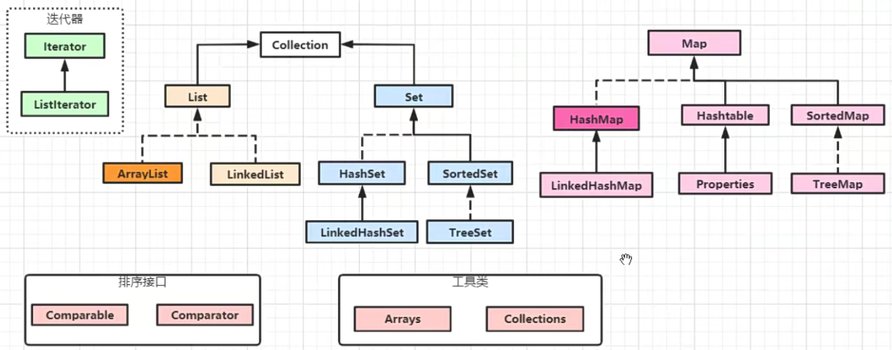
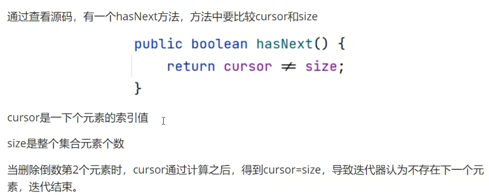

0. Java 集合类框架



---

1. ArrayList

> - Collection: List 和 Set父接口，里面包含了一些公用的方法;
> - List: 是一个有序的，不唯一接口;
> - ArrayList: 是List的一个实现类，底层数据结构是一个数组;

- add(Object obj): 在集合后面加入元素, 会返回一个boolean类型的值;
- add(int index, Object obj): 在指定索引位置前面插入一个元素, 没有返回值;
- size(): 获取当前集合中元素的个数；
- isEmpty(): 判断当前集合中是否为空；
- clear(): 从集合中删除所有元素；
- addAll(Collection c): 在当前集合中加入另一个集合的元素，要求两个集合使用的泛型相同；
- addAll(int index,Collection c): 在当前集合指定位置之前，加入另一个集合的元素；
- remove(int index): 移除指定索引位置的元素，并将该元素返回；
- remove(Object obj): 移除对应元素，如果有多个相同值，只移除第一个找到的元素，如果是整数类型，要封装成包装类，返回boolean类型的值，是否移除成功。
- removeAll(Collection c): 从当前集合中移除参数集合中所有包含的元素；
- retainAll(collection c): 在当前集合中保留参数集合中所有包含的元素；
- contains(Object o): 判断当前集合中是否包含给定参数的元素，返回boolean类型的值；
- containsAll(Collection c): 判断当前集合中是否包含给定参数集合的所有元素；
- toArray(): 以正序方式，返回一个包含所有元素的对象数组；
- indexOf(Object): 查找参数在当前集合中第一次出现的索引位置；
- lastIndexOf(Object): 查找参数在当前集合最后一次出现的索引位置；
- subList(int index, int end): 对当前集合进行截取，从起始位置(包含)截取到结束位置(不包含)，返回一个新的List集合;
- iterator(): 获取集合的迭代器;
- listIterator(): 获取集合的List迭代器;
- set(int index,Object obj): 设置索引位置的元素为参数Object;

2. Iterator 和 ListIterator 区别

> - Iterator 可以遍历 List 集合，也可以遍历 Set 集合, Listlterator 只能遍历 List 集合;
> - Iterator 只能单向遍历(向后遍历)，Listlterator 双向遍历(向前/向后遍历); 👍
> - Listlterator 继承 Iterator 接口，添加新的方法; ❤️ 【接口之间也可以继承，并且可以多继承】
>   ```java
>   public class TestInterface {
>   }
>
>   interface myInter1 {}
>   interface myInter2 {}
>   interface myInter3 extends myInter1, myInter2 {}
>   ```

- remove 方法
  - 对集合元素进行循环处理增加或删除时，不能使用 foreach 处理方式，要使用迭代器方式。 ❤️
  - 在 foreach 对集合中倒数第二个元素进行删除时，不会报错，其他位置的元素都会报错。
  - foreach 底层也是通过迭代器实现的。
  - 使用迭代器操作，有两个步骤:
    > iterator.hasNext();
    > item=iterator.next();
    >

底层源码分析：




```java
public class TestIterator {
    public static void main(String[] args) {
//        List<String> list = Arrays.asList("a", "b", "c", "d", "e"); // 固定大小数组，不能添加/移除数据
        List<String> list = new ArrayList<>(); // 固定大小数组，不能添加/移除数据
        list.add("a");
        list.add("b");
        list.add("c");
        list.add("d");
        Iterator<String> iterator = list.iterator();
//        while (iterator.hasNext()){
//            System.out.println(iterator.next());
//        }
        // 正向遍历
        ListIterator<String> listIterator = list.listIterator();
        listIterator.add("e"); // 迭代器起始位置在 0, 则这里在0位置插入， 插入位置为迭代器当前位置之前
        while (listIterator.hasNext()){
            System.out.println(listIterator.next());
        }
        System.out.println("--------------");
        ListIterator<String> listIterator1 = list.listIterator(); // 重新获取起始位置
        while (listIterator1.hasNext()){
            System.out.println((listIterator1.nextIndex() + " : " + listIterator1.next())); // nextIndex(): 返回集合中迭代器位置元素的索引
        }
        System.out.println("--------------");
        // 反向遍历
        ListIterator<String> listIterator2 = list.listIterator(list.size()); // 指定呆迭代器起始位置
        while (listIterator2.hasPrevious()){
            System.out.println(listIterator2.previousIndex() + " : " + listIterator2.previous());
        }
        listIterator2.set("GGG"); // 修改迭代器所在位置的值
        System.out.println(list);

        for (String s : list) {
            System.out.println(s);
//            list.remove(s); // 集合循环遍历时，不支持删除操作
        }
        while (listIterator2.hasNext()){
            String s = listIterator2.next();
            if("GGG".equals(s)) {
                listIterator2.remove(); // 调用迭代器的 remove 方法
            }
        }
        System.out.println(list);
    }
}
```

222
