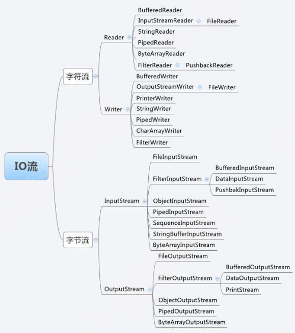
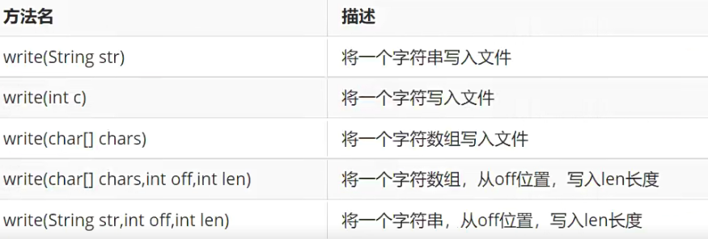
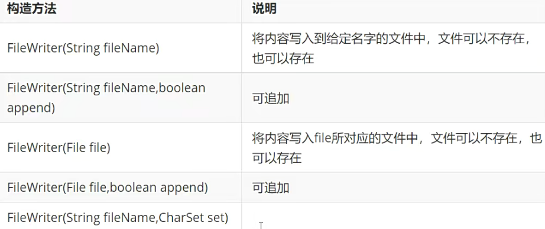
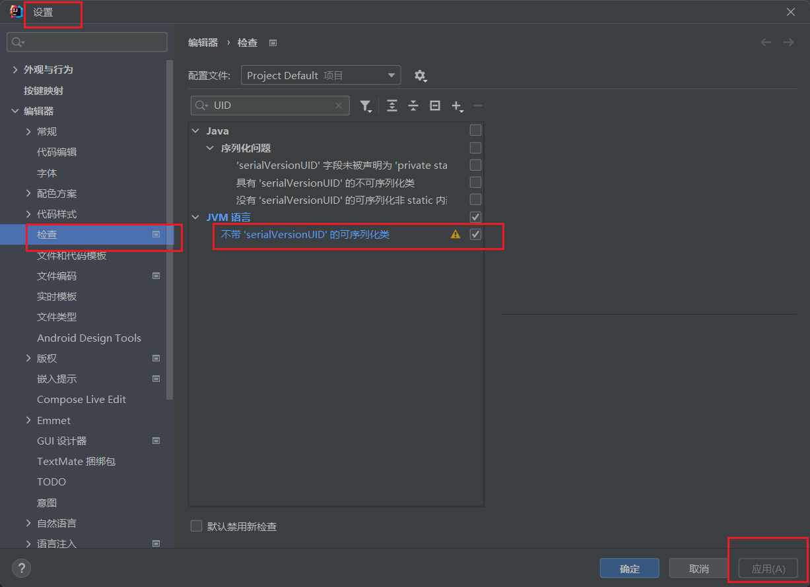

# 文件管理

java中，对文件和目录使用iava.io.File类来管理, 主要是针对文件或目录进行管理，包括属性信息的查看、文件或目录的删除、文件或目录的创建。

### 一、File类

#### 1. File 创建和删除

- File类构造；
- 文件/目录创建、删除；
  - mkidr: 存在路径才创建；
  - mkdirs：不存在，则创建路径；
  - File.createTempFile：创建临时文件；
  - deleteOnExit: 虚拟机退出时删除文件，没有返回值，一般用于临时文件；
  - delete: 删除，若目录下有文件/目录，则删除失败，删除目录应使用递归删除的方法；

```java
public class TestFile {
    public static void main(String[] args) throws InterruptedException {
        // 目录构造方法
        File dir = new File("javabase/resource");
        System.out.println(dir);
        // 文件构造方法
        File file = new File("javabase/resource/data.txt"); // 完整路径/相对路径
        File file1 = new File("javabase/resource", "data.txt"); // 目录 + 文件名
        File file2 = new File(dir, "data.txt"); // 目录对象 + 文件名
        System.out.println(file);
        System.out.println(file1);
        System.out.println(file2);

        // 创建文件 如果不存在，就创建并返回true，不存在则返回false
        File file3 = new File("javabase/resource/test.txt");
        try {
            boolean b = file3.createNewFile();
            System.out.println(b);
        } catch (IOException e) {
            e.printStackTrace();
        }
        // 创建目录 如果不存在，就创建并返回true，不存在则返回false
        File dir1 = new File("javabase/resource/test");
        File dir2 = new File("javabase/resource/test1/test");
        boolean mkdir = dir1.mkdir(); // mkdir 如果上级目录不存在，就返回false，创建失败
        boolean mkdir1 = dir2.mkdirs(); // mkdirs 如果上级目录不存在，同时创建
        System.out.println(mkdir);
        System.out.println(mkdir1);
        // 文件删除 如果删除成功就返回true, 否则就返回false，文件不存在也返回false
        File file4 = new File("javabase/resource/test.txt");
        boolean delete = file4.delete();
//        file4.deleteOnExit(); // 虚拟机退出时删除文件，没有返回值，一般用于临时文件
//        Thread.sleep(5000); // 程序休眠
        System.out.println(delete);
        // 创建临时文件
        try {
            File tempFile = File.createTempFile("tmp_", ".txt"); // 存在系统空间一般是【Temp】
            tempFile.deleteOnExit(); // JVM退出时删除
            System.out.println(tempFile.getAbsolutePath()); // C:\Users\SunLZ\AppData\Local\Temp\...
        } catch (IOException e) {
            e.printStackTrace();
        }
        // 目录循环删除
        File ff = new File("javabase/resource/test1/test/test.txt");
        try {
            ff.createNewFile();
        } catch (IOException e) {
            e.printStackTrace();
        }
        File dir3 = new File("javabase/resource/test1/test");
        boolean delete1 = dir3.delete(); // 删除目录时，如果目录下有文件或目录，则删除失败
        System.out.println(delete1);
        // 获取目录下的所有文件
//        File[] files = dir3.listFiles();
//        if (files != null) {
//            for (File f : files) {
//                System.out.println(f);
//                f.delete(); // 先删除目录下存在的文件
//            }
//        }
//        boolean delete2 = dir3.delete(); // 再删除目录
//        System.out.println(delete2);
         // 目录递归删除，合理的做法
        delDir(dir3);

    }
    public static void delDir(File dir){ // 递归删除目录
        if(dir.isDirectory()) {
            File[] files = dir.listFiles();
            for (File file : files) {
                // 判断当前循环到的是文件还是目录，如果是目录则递归删除
                if (file.isDirectory()) {
                    delDir(file);
                } else {
                    boolean delete = file.delete();
                    if (!delete) System.out.println("删除失败！");
                }
            }
        }
        boolean delete = dir.delete();
        if(!delete) System.out.println("删除失败！");
    }
}
```

#### 2. File 类的其它方法

```java
public class TestFileOther {
    public static void main(String[] args) {
        File file = new File("./javabase/resource/hello.txt");
        // 获取文件名
        System.out.println(file.getName());
        // 获取目录名
        System.out.println(file.getParent());
        // 获取所在目录
        File parentFile = file.getParentFile();
        System.out.println(parentFile.getName());
        // 获取文件大小 单位： 字节
        System.out.println(file.length()); // 单位： 字节
//        // 设置应用程序对文件是否可执行
//        file.setExecutable(true);
//        // 设置应用程序对文件是否可读
//        file.setReadable(true);
//        // 设置应用程序对文件是否可写
//        file.setWritable(true);
        // 测试应用程序对文件是否可执行
        boolean b = file.canExecute();
        System.out.println(b);
        // 测试应用程序对文件是否可读
        boolean b1 = file.canRead();
        System.out.println(b1);
        // 测试应用程序对文件是否可写
        boolean b2 = file.canWrite();
        System.out.println(b2);
        // 获取文件路径
        System.out.println(file.getPath());  // 1. 这里获取的与File file = new File("...")构建时传入的参数一致
        System.out.println(file.getAbsolutePath()); // 2. 获取绝对路径
        try {
            System.out.println(file.getCanonicalPath());  // 3. 精准获取绝对路径方式，可去除在构造时给的相对路径的 ./../.
        } catch (IOException e) {
            throw new RuntimeException(e);
        }
        // 获取文件最后修改时间
        // file.lastModified() 返回long时间戳
        System.out.println(DateTimeFormatter.ofPattern("yyyy-MM-dd hh:mm:ss").format(LocalDateTime.ofInstant(Instant.ofEpochMilli(file.lastModified()), ZoneId.systemDefault())));
        // 获取磁盘空间的操作
        // 获取文件按所在磁盘总容量 字节
        System.out.println(file.getTotalSpace());
        // 获取文件按所在磁盘剩余容量 字节
        System.out.println(file.getFreeSpace());
        // 获取JVM可用空间大小
        System.out.println(file.getUsableSpace());
        // 获取所有磁盘分区, 返回分区根路径的File对象组成的File数组
        File[] disks = File.listRoots();
        Arrays.stream(disks).forEach(System.out::println);
        // 对文件的重命名 可以将文件命名到其他目录(已存在)或盘符下
        // 可以实现文件剪切工作
        boolean b3 = file.renameTo(new File("./javabase/resource/hello.txt"));
        System.out.println(b3);
        // 判断文件是否是隐藏文件
        boolean b4 = file.isHidden();
        System.out.println(b4);
    }
}
```

### 二、IO流

是一串连续不断的数据集合，对于程序中数据的输入和输出，都是以数据流的方式进行操作。

> Input 流: 输入流/读流
> Output 流: 输出流/写流

站在当前正在运行的程序的角度，来看数据是输入还是输出；

- 源: 键盘、文件、网络URL地址、扫描仪、物联网设备等；
- 目标: 屏幕、文件、网络URL地址、数据库、物联网设备等；

#### 1. IO流的分类

> - 按流的方向划分: 输入流、输出流；
> - 按处理数据单位划分: 字节流、字符流；
> - 按功能不同: 节点流、处理流；

#### 2. 四个主要类 流API

- InputStream: 面向字节的输入流；
- OutputStream: 面向字节的输出流；
- Reader: 面向字符的输入流；
- Writer: 面向字符的输出流；



#### 3. 文件流操作

FileReader、FileWriter、FileInputStream、FileOutputStream

> 字符流实现原理: 字节流 + 编码表
>
> 字符集: unicode字符集 UTF-8、UTF-16、UTF-32、GB2312、GBK、GB1030

不管是读文件，还是写文件，步骤: 1.打开流 2.读/写文件 3.关闭流；

- FileWriter



```java
public class TestFileWriter {
    public static void main(String[] args) throws IOException {
        FileWriter fileWriter = new FileWriter(".\\javabase\\resource\\hello.txt");
        fileWriter.write("我是大傻逼");
        fileWriter.flush(); // 刷入磁盘
        fileWriter.write("我是大傻逼");
        for (int i = 0; i < 10000; i++) {
            fileWriter.write(i + "\t");
            if (i%100==0) fileWriter.write("\n");
        }
        fileWriter.close(); // 只有【关闭了/刷入磁盘/缓冲区满了】才算真正写入文件
        // 使用try catch 自动关闭资源
        try(FileWriter fileWriter1 = new FileWriter(".\\javabase\\resource\\hello1.txt")){
            for (int i = 0; i < 10000; i++) {
                fileWriter1.write(i + "\t");
                if (i%100==0) fileWriter1.write("\n");
            }
        } catch (IOException e){
            e.printStackTrace();
        }
    }
}
```



```java
public class TestWriter {
    public static void main(String[] args) throws IOException {
        // 字符数组 / 字符串 写入
//        FileWriter fileWriter = new FileWriter(".\\javabase\\resource\\hello.txt");
//        char[] chars = {'中', '国', '人'};
//        String str = "我是中国人";
//        fileWriter.write(chars);
//        fileWriter.write(chars, 0, 2);
//        fileWriter.write(str, 0, 2);
//        fileWriter.write(str);
//        fileWriter.close();

        // 构造方法一
//        FileWriter fileWriter1 = new FileWriter(".\\javabase\\resource\\hello.txt");
        // 构造方法二 第二个参数true，表示追加写入
        FileWriter fileWriter2 = new FileWriter(".\\javabase\\resource\\hello.txt", true);
        fileWriter2.write("中国人不骗中国人");
        fileWriter2.close();
        // 构造方法三 转入File对象
        File file = new File(".\\javabase\\resource\\hello.txt");
//        FileWriter fileWriter3 = new FileWriter(file);
        // 构造方法四
        FileWriter fileWriter4 = new FileWriter(file, true);
        fileWriter4.write("我是中国人");
        fileWriter4.close();
        // 构造方法五 指定编码方式
        FileWriter fileWriter5 = new FileWriter(file, StandardCharsets.UTF_8);
    }
}
```

- BufferedWriter

> BufferedWriter 和 FileWriter的区别:
>
> - FileWriter 内部有 8192 个字节缓冲区;
> - BufferedWriter 内部有 8192个 字符(16384个字节);
> - 使用 BufferedWriter 可以指定缓冲区大小;
> - FileWriter 效率低，每次来一个字符，要査一次码表，BufferedWriter，缓冲区字符存满或者 close/flush 之后，才会进行查码表;

如果频繁去写文件，最好使用BufferedWriter处理，如果只写一次，FileWriter就可以使用;

```java
public class TestBufferWriter {
    public static void main(String[] args) throws IOException {
        FileWriter fileWriter = new FileWriter(".\\javabase\\resource\\hello.txt", true);
//        BufferedWriter bufferedWriter = new BufferedWriter(fileWriter);
        BufferedWriter bufferedWriter = new BufferedWriter(fileWriter, 8000); // 第二个参数指定缓冲区大小
        bufferedWriter.write("我爱中国");
//        bufferedWriter.write("\r\n");
        bufferedWriter.newLine();
        bufferedWriter.write("我爱中国");
        bufferedWriter.close();
    }
}
```

- FileReader

```java
public class TestFileReader {
    public static void main(String[] args) throws IOException {
        FileReader fileReader = new FileReader(".\\javabase\\resource\\hello.txt");
        // 文件读取 1
//        int read;
//        while ((read = fileReader.read()) != -1) {  // 每次读取一个字符，返回读取到的字符，返回int类型，如果达到流的结尾，就返回-1
//            System.out.print((char) read);
//        }
        // 文件读取 2
//        char[] chars = new char[1024];
//        int len = fileReader.read(chars);// 将字符存入数组中，并返回一共读取到多少个字得
//        System.out.println("一共读取到" + len + "个字符");
//        System.out.println(new String(chars, 0, len));
        // 文件读取 3
        char[] chars = new char[1024];
        fileReader.skip(4); // 跳过前4个数据
        int len = fileReader.read(chars, 0, 20);
        System.out.println("一共读取到" + len + "个字符");
        System.out.println(new String(chars, 0, len));
    }
}
```

- BufferedReader

```java
public class TestBufferedReader {
    public static void main(String[] args) throws IOException {
        FileReader fileReader = new FileReader(".\\javabase\\resource\\hello.txt");
        BufferedReader bufferedReader = new BufferedReader(fileReader);
        String s;
        while ((s = bufferedReader.readLine())!=null) // 每次读取一行，返回一个字符串
            System.out.println(s);
        bufferedReader.close();
    }
}
```

- FileInputStream

```java
public class TestFileInputStream {
    public static void main(String[] args) throws IOException {
        FileInputStream fileInputStream = new FileInputStream(".\\javabase\\resource\\hello.txt");
        // 字节流转换为字符流
        InputStreamReader inputStreamReader = new InputStreamReader(fileInputStream, StandardCharsets.UTF_8);
//        BufferedReader bufferedReader = new BufferedReader(inputStreamReader);
        int read;
        while ((read = inputStreamReader.read()) != -1) {
            System.out.print((char) read); // 中文会出现乱码，需要将字节流转化为字符流
        }
        fileInputStream.close();
        // 读取二进制文件
        File src = new File(".\\javabase\\resource\\image0.png");
        File dest = new File(".\\javabase\\resource\\test\\image0_1.png");
        copyByteFile(src, dest);
    }

    public static void copyByteFile(File src, File dest) throws IOException {
        FileInputStream fileInputStream = new FileInputStream(src);
        FileOutputStream fileOutputStream = new FileOutputStream(dest);
        // 反复对文件进行读取，用 Buffered 更合理一些，效率更高
        BufferedInputStream bufferedInputStream = new BufferedInputStream(fileInputStream);
        BufferedOutputStream bufferedOutputStream = new BufferedOutputStream(fileOutputStream);
        int flag;
        while ((flag = bufferedInputStream.read()) != -1) {
            bufferedOutputStream.write(flag);
        }
        fileInputStream.close();
        fileOutputStream.close();
    }
}

```


### 三、对象的序列化与反序列化

#### 1. 对象的序列化

> 把在内存当中的数据，要远程传输到网络上或者保存到硬盘上，需要将java对象转换为字节序列，可以转换成可传输的文件流;
>
> 什么样的对象可以被序列化？（类要实现以下接口之一）
>
> - Serializable
> - Externalizable

- ObjectOutputStream 完成对象序列化操作


#### 2. 对象的反序列化

> 把字节序列重新恢复为java对象的过程

ObjectInputStream 完成对象反序列化操作


- serialVersionUID

> 每次调用 ObjectOutputStream 来完成序列化时，都会有一个序列化编号，如果没有显式地生成，系统会自动生成一个。在做反序列化，系统会重新生成一个新的版本号，和之前的去比较，就会出现版本号不一致的错误。所以为了避免出现这种问题，一般都会显式地为序列化声明一个版本号。  👍
>
>> local class incompatible: stream classdesc serialversionuID =185946447685475229,1ocal class serialversionuD = 8090034645353830909
>>



> IDEA 开启警告，可在实现了 Serializable 接口的类型但没有给出 serialVersionUID 字段时发出警告，并可生成 serialVersionUID


#### 3. 序列化需要注意的问题 ❤️ 

- 对象可序列化，需要实现相应的接口；
- 要序列化的对象，属性是一个引用类型，要求这处引用类型也是可序列化的，否则，这个对象不可以被序列化；
- 使用 transient 有选择的序列化； 👍
- 对象的类名、属性名和属性值都会被序列化，方法、static属性、transient属性都不会被序列化； 👍

```java
public class TestObjectOutputStream {
    public static void main(String[] args) throws IOException, ClassNotFoundException {
        Student student = new Student("曹孟德", 27);
        File file = new File(".\\javabase\\resource\\obj.stu");
        // 序列化
        FileOutputStream fileOutputStream = new FileOutputStream(file);
        ObjectOutputStream objectOutputStream = new ObjectOutputStream(fileOutputStream);
        objectOutputStream.writeObject(student);
        objectOutputStream.close();
        // 反序列化
        FileInputStream fileInputStream = new FileInputStream(file);
        ObjectInputStream objectInputStream = new ObjectInputStream(fileInputStream);
        Student s = (Student) objectInputStream.readObject();
        System.out.println(s);
        objectInputStream.close();
        // 序列化相关问题
        Student student1 = new Student("张三", 18, new Book("厚大法考"));
        File file1 = new File(".\\javabase\\resource\\obj1.stu");
        FileOutputStream fileOutputStream1 = new FileOutputStream(file);
        ObjectOutputStream objectOutputStream1 = new ObjectOutputStream(fileOutputStream1);
        objectOutputStream1.writeObject(student1);
        objectOutputStream1.close();

    }
}

class Student implements Serializable { // Serializable 不需要实现任何方法，只是一个可以被序列化的声明
    private static final long serialVersionUID = 3519662762363735564L; // IDEA 自动生成的版本号
    public static int test; // static 字段不会被实例化
//    private static final long serialVersionUID = 123L; // 显式生成版本号
    public String name;
    public Integer age;
    public transient Book book; // transient 关键字可以指定某些字段不被序列化，比如不可序列化类型、密码等
//    public Book book;

    public Student(String name, Integer age) { // 方法不会被实例化
        this.name = name;
        this.age = age;
    }

    public Student(String name, Integer age, Book book) {
        this.name = name;
        this.age = age;
        this.book = book;
    }

    @Override
    public String toString() {
        return "Student{" +
                "name='" + name + '\'' +
                ", age=" + age +
                ", book=" + book +
                '}';
    }
}
class Book {
    public String name;

    public Book(String name) {
        this.name = name;
    }

    @Override
    public String toString() {
        return "Book{" +
                "name='" + name + '\'' +
                '}';
    }
}
```


#### 4. 使用 Externalizable 实现序列化

> Serializable 使用的问题:
>
> - 序列化过程是递归，相对较缓慢;
> - 对于需要禁止序列化的变量，需要使用 transient 关键字修饰，对于属性较多，又有一些不需要序列化的变量，整体操作较复杂;
> - 无法控制字段的序列化和反序列化的方式；
> - 序列化过程在处理对象时，不会调用构造方法，因此会造成构造方法内的逻辑缺失。

Externalizable： ❤️ 

- 是 Serializable 接口的子接口，如果要使用 Externalizable 来实现序列化，只需要让序列化类实现 Externalizable 接口，并重写 writeExternal 和 readExternal 方法。
- Externalizable 在序列化流程上，和Serializable是一样的。主要差别在于使用 Externalizable 可以重写 writeExternal 和 readExternal 方法，精准控制。
- Externalizable 做反序列化时，会调用序列化类的构造方法，要求类中要有默认无参的构造方法。 👍
- Externalizable 对于 static 属性和 transient 属性，没有 Serializable 的限制，都可以进行序列化。 👍

```java
public class TestExternalizable {
    public static void main(String[] args) throws IOException, ClassNotFoundException {
        Hero hero = new Hero("曹操", 5000, 10);
        // 序列化
        ObjectOutputStream objectOutputStream = new ObjectOutputStream(new FileOutputStream(".\\javabase\\resource\\obj.h"));
        objectOutputStream.writeObject(hero);
        objectOutputStream.close();
        // 反序列化
        ObjectInputStream objectInputStream = new ObjectInputStream(new FileInputStream(".\\javabase\\resource\\obj.h"));
        Hero h = (Hero) objectInputStream.readObject();
        System.out.println(h);
    }
}

class Hero implements Externalizable {
    private static final long serialVersionUID = 6182993074377375044L;
    private static String test;
    public String name;
    public Integer blood;
    public transient Integer buff;

    public Hero() { // Externalizable 序列化会调用无参构造，若无参构造不存在会报错
        System.out.println("调用无参构造");
    }

    public Hero(String name, Integer blood, Integer buff) {
        this.name = name;
        this.blood = blood;
        this.buff = buff;
        System.out.println("调用有参构造");
    }

    @Override
    public void writeExternal(ObjectOutput out) throws IOException { // Externalizable 序列化字段自己控制，不受限于 static 和 transient
        out.writeUTF(name);
        out.writeInt(blood);
        out.writeInt(buff);
    }

    @Override
    public void readExternal(ObjectInput in) throws IOException, ClassNotFoundException { // Externalizable 序列化字段自己控制，不受限于 static 和 transient
        name = in.readUTF();
        blood = in.readInt();
        buff = in.readInt();
    }

    @Override
    public String toString() {
        return "Hero{" +
                "name='" + name + '\'' +
                ", blood=" + blood +
                ", buff=" + buff +
                '}';
    }
}
```


### 四、Java 标准输入输出

> - System.in: 标准输入，默认是对应键盘
> - System.out: 标准输出，默认是对应显示器
> - System.err: 标准错误输出，默认是对应显示器

```java
public class TestSystemInOut {
    public static void main(String[] args) throws IOException {
        // 从键盘接收参数
        // 方法一
        Scanner scanner = new Scanner(System.in);
        // 方法二
        InputStream inputStream = System.in;
        InputStreamReader inputStreamReader = new InputStreamReader(inputStream);
        BufferedReader bufferedReader = new BufferedReader(inputStreamReader);
        String s = bufferedReader.readLine(); // 读取一行字符串
        System.out.println(s);
        bufferedReader.close();
        // 标准输出
        PrintStream printStream = System.out;
        printStream.print("hello");
        // 标准错误输出
        System.err.print("错误"); // 红色字体
        // 标准输入输出的扭转操作
        FileInputStream fileInputStream = new FileInputStream(".\\javabase\\resource\\hello.txt");
        System.setIn(fileInputStream); // 重新分配”标准“输入流，将键盘接受输入扭转到文件
        FileOutputStream fileOutputStream = new FileOutputStream(".\\javabase\\resource\\hello2.txt");
        System.setOut(new PrintStream(fileOutputStream)); // 重新分配”标准“输出流，，将输出到显示器扭转到文件
        BufferedReader bufferedReader1 = new BufferedReader(new InputStreamReader(System.in));
        String s1;
        while ((s1=bufferedReader1.readLine())!=null){
            System.out.println(s1);
        }
        bufferedReader1.close();
    }
}
```


### 五、ByteArrayInputStream 和 ByteArrayOutputStream

---

- FileInputStream、FileOutputStream、FileReader、FileWriter是存储在硬盘上的，硬盘上的资源java虚拟机是无权直接访问的，必须借助操作系统，java虚拟机借助完了之后要通知操作系统释放资源；
- 我们可以把源头换成电脑上的一块内存，既然是一块内存那么java就可以直接访问，因为是java虚拟机的一块内存。不用关闭(释放)
- 所有的东西都可以转成字节数组(字符串转成字节数组、任何一个数据(包括整数、包括浮点数、包括一个一个的对象都可以转成字节数组))
- 字节数组就为二进制了，方便网络上进行传输
- 文件可以无限制的往里面加内容，但是内存速度快、量小，所以字节数组不建议数据量特别大的操作；


### 六、DataInputStream 和 DataOutputStream

---


- 在执行文件存取一个对象的数据成员时，如果只操作一个或几个属性，并且数据成员都是java的基本数据类型或字符串，则不需要使用到对象序列化技术。可以使用DataIputStream和DataOutputStream来写入或读取数据操作。
- 写入和读取的时候，不用自行判断读入数据何时停止，只需要使用对应的方法(readUTF或readlnt等等),就可以能够正确读入数据类型。
- 写入的顺序和读取的顺序要保持一致。
