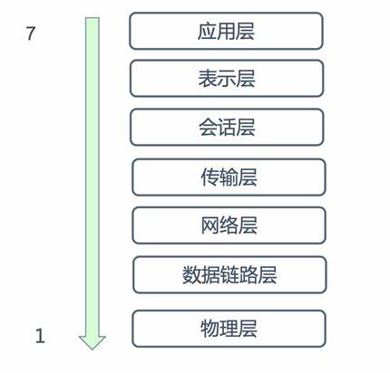
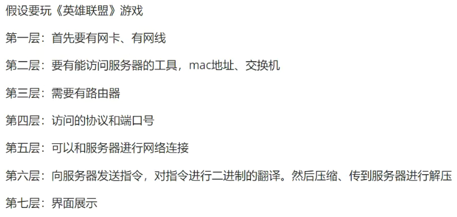
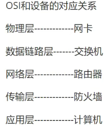
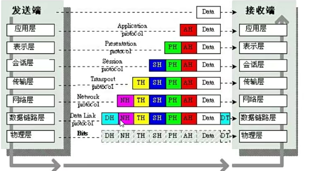
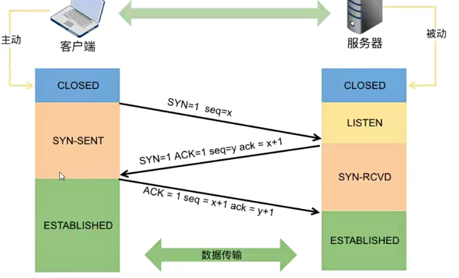
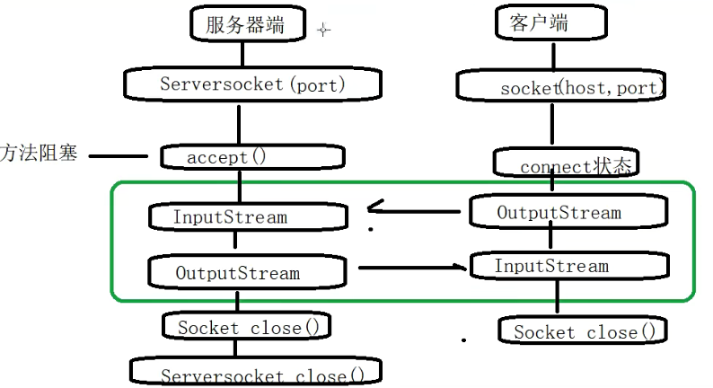
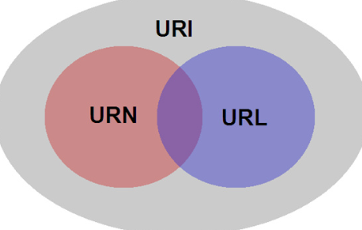

# 网络编程

## 一、网络基础知识

### 1. 计算机网络

指将地理位置不同的具有独立功能的多台计算机及其外部设备，通过通信线路连接起来，在网络操作系统、网络管理软件以及网络通信协议的管理和协调下，实现资源共享和信息传递的计算机系统.

### 2. OSI七层模型

OSI (Open System Interconnect) 开放式系统互联，一般也称作 OSI 参考模型。是由ISO(国际标准化组织)研究的网络互联模型。早期网络在各大公司的内部，是互通的，但是在外部，是不相通的。因为没有一个统一的规范，外部计算机之间互相传输数据和信息，对方是不能理解的。所以不能互联。意义在于推荐所有公司使用这个规范来控制网络，具有相同的规范，就可以互联。



- 第一层物理层: 建立、维护、断开物理连接(网卡、网线、光纤、集线器、中继器、调制解调器)报文头部和上层数据信息。都是由二进制数组成的。物理层将这些二进制数字组成的比特流转换成**电信号**在网络中传输;
- 第二层数据链路层: 建立逻辑连接、进行硬件地址寻址、差错校验等功能。将上层数据加上源和目的方的物理(MAC)地址封装成**数据帧**;
- 第三层网络层: 进行逻辑地址寻址，实现不同网络之间的路径选择(路由器)，将上层的数据加上源和目的方的逻辑(IP)地址封装成**数据包**，实现数据从源到目的地的传输;
- 第四层传输层: 定义传输数据的协议端口号，以及流控和差错校验(防火墙)，将上层的数据分片并加上端口号封装成**数据段**，或者通过对报文头中的端口识别，实现数据从源到目的地的传输;
- 第五层会话层: 建立、管理、中止会话，管理是否允许不同机器上的用户之间建立会话连接关系;
- 第六层表示层: 数据的表示、安全、压缩，将接收到的数据翻译成二进制数组成的计算机语言，并对数据进行压缩和解压，数据加密和解密工作;
- 第七层应用导: 网络服务与最终用户的一个接口，人机交互窗口。





- 上三层总称应用层: 用来控制软件方面 👍
- 下四层总称数据流层: 用来管理硬件方面 👍



### 3. TCP/IP

> Transfer(Transmission) Control Protocol / Internet Protocol : 传输控制协议 / 网际(网络)协议

- 指能够在多个不同网络间实现信息传输的协议簇。TCP/IP 不仅指 TCP 和 IP 两个协议，而是指一个由FTP、SMTP、TCP、UDP、IP等协议构成的协议簇; ❤️
- 对互联网中各部分进行通信 的标准和方法进行规定。是保证网络数据信息及时、完整传的重要协议;
- TCP/IP 是一个四层的体系结构: 应用层、传输层、网络层和物理+数据链路层;

#### (1) 传输层协议

- UDP协议:
  - 一个无连接的传输协议，称为用户数据报协议(User Datagram Protocol);
  - 提供了一种无需建立连接可以发送封装的IP数据包的方法;
  - 协议比较简单，实现容易，但是没有确认机制，数据包发送出去，无法知道对方是否收到，可靠性较差，但效率比较高;
  - 包含报头在内的数据最大长度是 64k;
- TCP协议
  - 是面向连接的、可靠的、基于字节流的通信协议;
  - 是一种有确认机制的协议，每发出一个数据包都要求确认，如果有一个数据包丢失，接收方不会进行确认，发送方就必须要重新发这个数据包;
  - TCP的三次握手: 目的是为了确认客户端和服务端的收发功能是否正常;



## 二、网络编程

对信息的发送到接收，中间传输为物理线路。主要的工作就是在发送端把信息通过规定的协议进行组装包，在接收端按照规定协议把数据包进行解析，从而提取对应的信息，达到通信的目的。中间最主要析就是数据包的组装、过滤、捕获、分析、处理。

### 1. 三要素

- 协议: 为计算机网络中进行数据交换而建立的各种规则、标准或约定的集合;
- IP地址: IP地址(Iinternet Protocol Address)，互联网协议地址，IP地址像我们家庭住址一样，如果要给一个人发快递，需要知道地址，才能由快递员把包裹送到;
  - IPV4: 以点进行划分，将一个地址划分成4个部分，每一组构成8位地址，可以算出42亿以上唯一地址;
  - IPV6: 并不是一种全新的技术，旨在替换IPV4地址，使用冒号分隔的十六进制数字，分为八个16位块，构成一个128位的地址方案;
- 端口号: 计算机通过IP地址来代表其身份，只能表示某台特定的计算机。但是一台计算上可以同时提供多个服务，比如数据库服务\FTP服务\Web服务，通过端口号来区别在相同的计算上，所提供的不同服务;

> 21端口号 表示是 FTP
> 23端口号 表示 Telnet
> 25端口号 表示 SMTP
> 80端口号 表示 HTTP
> 从 0-65535 个端口号，1024以下的端号保留给预定义的服务

### 2. 网络开发的两种模式

#### (1) C/S 结构

Client/Server 客户端/服务器模式: 服务器通常高性能的PC、工作站或小型机，并使用大型软件(数据库、WebLogic)。客户端通过安装客户端专用软件。合理分配了任务，给客户端和服务器，降低了系统的通讯开销，充分利用两端硬件环境优势。

#### (2) B/S 结构

Browser/Server 浏览器/服务器模式:是WEB兴起后的一种网络结构模式。WEB浏览器是客户端主要的应用软件。统一客户端，将系统功能的核心全部集中到服务器上，简化系统开发、维护和使用。

### 3. Socket 编程

> Socket(套接字): 是进程间通信的一种方式，可以实现不同主机间的进程通信。应用程序通过 Socket 向网络发出请求或者响应网络请求。使用Socket来实现两个程序间的双向通讯，通迅的两端都有 Socket，数据在两个Socket之间通过IO来进行传输;

工作流程:




UDP:

```java
public class UDPSocket1 {
    public static void main(String[] args) throws IOException {
        DatagramSocket datagramSocket = new DatagramSocket(3333);
        byte[] bytes = new byte[1024];
        DatagramPacket datagramPacket = new DatagramPacket(bytes, bytes.length);
        datagramSocket.receive(datagramPacket);
        String msg = new String(bytes, 0, datagramPacket.getLength(), StandardCharsets.UTF_8);
        System.out.println(msg);
    }
}

public class UDPSocket2 {
    public static void main(String[] args) throws IOException {
        // 创建Socket
        DatagramSocket datagramSocket = new DatagramSocket(2222);
        // 消息转为byte数组
        String msg = "你好";
        byte[] bytes = msg.getBytes(StandardCharsets.UTF_8);
        // 创建数据包
        DatagramPacket datagramPacket = new DatagramPacket(bytes, 0, bytes.length, InetAddress.getByName("localhost"), 3333);
        // 调用send方法发送消息
        datagramSocket.send(datagramPacket);
    }
}
```

### 4. 统一资源定位符 URL




- URI（Uniform Resource Identifier，统一资源标识符)是一个用于标识某一互联网资源名称的字符串。 该种标识允许用户对网络中（一般指万维网）的资源通过特定的协议进行交互操作。
- URL(Uniform Resource Locator，统一资源定位符），最常见的形式是 URI,经常指定为非正式的网址。
- URN（Uniform Resource Name，统一资源名称），其目的是通过提供一种途径，用于在特定的命名空间资源的标识，以补充网址。

> URI 可以进一步划分为定位符（URL），名称（URN）或两者兼备。URL 和 URN 都是 URI 子集。URN 如同一个人的名称，而 URL 代表一个人的住址。换言之，URN 定义某事物的身份，而 URL 提供查找该事物的方法。
>
> 用于标识唯一书目的 ISBN 系统是一个典型的 URN 使用范例。例如，ISBN 0-486-27557-4( urn:isbn:0-486-27557-4 )无二义性地标识出莎士比亚的戏剧《罗密欧与朱丽叶》的某一特定版本。为获得该资源并阅读该书，人们需要它的位置，也就是一个 URL 地址。在类 Unix 操作系统中，一个典型的 URL 地址可能是一个文件目录，例如 file:///home/username/RomeoAndJuliet.pdf。该 URL 标识出存储于本地硬盘中的电子书文件。因此，URL 和 URN 有着互补的作用。

```java
public class TestURL {
    public static void main(String[] args) throws IOException, URISyntaxException {
        URL url = new URL("https://img1.baidu.com/it/u=3766269883,2205628513&fm=253&fmt=auto&app=120&f=JPEG?w=606&h=342");
        int port = url.getPort();
        String file = url.getFile();
        String host = url.getHost();
        URI uri = url.toURI();

        System.out.println(port);
        System.out.println(file);
        System.out.println(host);
        System.out.println(uri);

        URLConnection urlConnection = url.openConnection();
        InputStream inputStream = urlConnection.getInputStream();
        BufferedInputStream bufferedInputStream = new BufferedInputStream(inputStream);
        FileOutputStream fileOutputStream = new FileOutputStream("D:\\MyProject\\Java\\JavaLearning\\javabase\\resource\\test\\download.jpg");
        BufferedOutputStream bufferedOutputStream = new BufferedOutputStream(fileOutputStream);

        byte[] bytes = new byte[1024];
        int x;
        while ((x=bufferedInputStream.read(bytes))!=-1){
            bufferedOutputStream.write(bytes, 0, x);
        }
        bufferedInputStream.close();
        bufferedOutputStream.close();
    }
}
```


---
