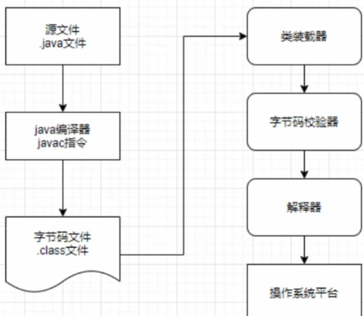
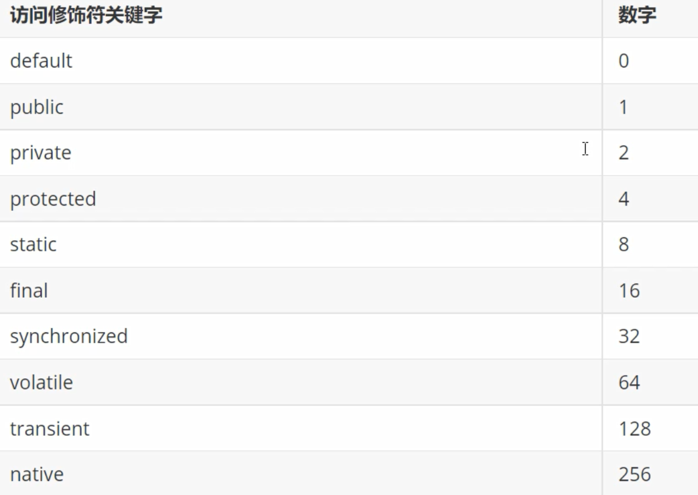
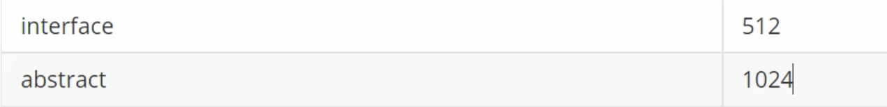

# 反射机制

- 反射机制是 Java 被视为动态语言的关键，允许程序在执行期间，借助于 ReflectionAPI 取得任何类的内部信息。
- 在程序的运行状态中，可以构造任意一个类的对象，可以了解任意一个类对象所属的类，可以了解任意一个类的成员变量和方法，可以调用任意一个对象的属性和方法。
- 这种动态获取程序信息以及动态调用对象的功能称为 Java 反射机制。

Java 反射机制提供的功能：

1. 在运行时判断任意一个对象所属的类；
2. 在运行时构造任意一个类的对象；
3. 在运行时查看任意一个类所具有的成员变量和方法；
4. 在运行时调用任意一个对象的方法；
5. 在运行时给任意一个对象的属性赋值；
6. 生成动态代理；

### 动态语言和静态语言

- 动态语言: 在运行时可以改变其结构的语言，比如新的函数、对象、甚至代码可以被引进，已有的函数可以被删除或是其他结构上的变化。也就是说在运行时代码可以根据某些条件改变自身结构。

> 主要的动态语言: C#、javaScript、PHP、Python等

- 静态语言: 运行时结构不可变的语言，就是静态语言。

> 包括 Java、C、C++等。但 Java 有一定的动态性, 可以利用反射机制、字节码操作获得类似动态语言的特性。❤️

## 一、Class 类

- Java 在将 .class 字节码文件载入时，JVM 会产生一个java.lang.Class对象代表该.class字节码文件。
- Class 是一个比较特殊的类，是java反射机制的基础。
- Class 类的对象表示正在运行的java程序中的类或接口。也就是任何一个类被加载时，即将类的.class文件读入内存的同时，都自动为其创建一个java.lang.Class对象。❤️
- Class 类没有公共构造方法，其对象是JVM在加载类时通过调用类加载器中的 defineClass() 方法创建的，因此不能显式地创建一个Class对象。❤️
- 通过 Class 对象，才可以获取这个类对象的其他信息。

> 👀️ 每个类只加载一次：每个类被加载之后，系统都会为该类生成一个对应的 Class 对象，一旦类被加载到 JVM 中，同一个类将不会被再次载入。

### 1. 获得 Class 对象的方法

#### （1）方式一：

使用 Class 类的静态方法 forName(String className), 参数className表示所需类的全路径, 如果给的参数类找不到, 会抛出 ClassNotFoundException 异常。

```java
Class<?> clazz = Class.forName("com.slz.javalearing.day21.Joker");
```

#### （2）方式二:

用类名调用 class 属性来获取该类对应的 Class 对象，“类名.class"。

```java
Class<?> jokerClass = Joker.class;
```

#### （3）方法三：

使用该类的对象调用 getClass() 方法，来获取该类对应的Class对象。

```java
Joker joker = new Joker("张三", 18);
Class<?> aClass = joker.getClass();
```

（4）方法四：

使用类加载器的类加载方法：

```java
   ClassLoader classLoader = Joker.class.getClassLoader();
   Class<?> aClass1 = classLoader.loadClass("com.slz.javalearing.day21.Joker");
```

### 2. 哪些类型可以有Class对象？👍

> 7 种

- class: 外部类、成员内部类、静态内部类、局部内部类、匿名内部类
- interface: 接口
- 数组
- enum: 枚举
- annotation: 注解
- 基本数据类型：int double char...........
- void

```java
public class TestGetClass {
    public static void main(String[] args) throws ClassNotFoundException {
        // 方法一
        Class<?> clazz = Class.forName("com.slz.javalearing.day21.Joker");
        // 方法二
        Class<?> jokerClass = Joker.class;
        System.out.println(clazz==jokerClass); // true 类只载入一次
        // 方法三
        Joker joker = new Joker("张三", 18);
        Class<?> aClass = joker.getClass();
        // 方法四
        ClassLoader classLoader = Joker.class.getClassLoader();
        Class<?> aClass1 = classLoader.loadClass("com.slz.javalearing.day21.Joker");

        // 以上都是class

        // interface 接口
        Class<?> jokerInterClass = JokerInter.class;
        // 数组
        int[] nums = new int[3];
        Class<?> aClass2 = nums.getClass();
        Class<?> aClass3 = int[].class;
        // 基本数据类型
        Class<?> doubleClass = double.class;
        // void
        Class<?> voidClass = void.class;
        // 枚举
        Class<?> enumClass = Enum.class;
    }
}
```

## 二、类加载器 ClassLoader

一个用来加载类文件的类，java 源代码通过 javac 编译器编译成类文件，然后 jvm 通过类文件中的字节码执行程序，类加载器负责加载文件系统、网络或者其它的类文件。



### ❤️ Java类装载器的作用就是在运行时加载类。基于三个机制：

- 🔴 委托机制: 加载一个类的请求交给父类加载器，如果这个父类加载器找不到要加载的类，那么子类再加载它。防止自定义的类与核心类重名，替代掉核心类导致的风险。
- 🔴 可见性机制：子类的加载器可以看见所有的父类加载器加载的类，但是父类加载器看不到子类加载器加载的类。
- 🔴 单一性机制：加载一个类，仅加载一次，可以确保在委托机制中，如果父类加载器已经加载过这个类了，子类加载器不会再次加载。

⭐️ 加载的两种方式

- 隐式加载: 程序在运行过程中，通过 new 等方式生成对象时，隐式调用类加载器加载对应的类进入到JVM中；
- 显式加载: 通过 Class.forName() 等方法，显式地加载需要的类；

⭐️ 加载器的分类

JDK 默认提供三种 ClassLoader：

- BootstrapClassLoader: 根装载器, 它使用 C++ 编写，所以在 Java 中看不到它，负责装载核心类库；
- ExtClassLoader: (PlatformClassLoader（JDK9版本之后))扩展类装载器，装载扩展目录ext中的jar类；
- AppClassLoader: 系统类装载器(应用类装载器)，负责classpath类的加载；

```java
public class TestClassLoader {
    public static void main(String[] args) {
        ClassLoader classLoader = TestClassLoader.class.getClassLoader();
        System.out.println(classLoader); // jdk.internal.loader.ClassLoaders$AppClassLoader@71bc1ae4
        ClassLoader classLoader1 = classLoader.getParent();
        System.out.println(classLoader1); // jdk.internal.loader.ClassLoaders$PlatformClassLoader@58ceff1
        ClassLoader classLoader2 = classLoader1.getParent();
        System.out.println(classLoader2); // null
    }
}
```

❤️ JVM 装载类时使用 "全盘负责委托机制",当一个 ClassLoader 一个类的时候，除非显式地使用另一个ClassLoader，不然该类所依赖及引用的类也是由这个 ClassLoader 载入。

❤️ 一个应用程序总是由很多个类组成，java 程序启动时，并不是一次把所有的类加载再运行。总是先把保证程序运行的基础类一次性加载到 JVM 中，其他类等到 JVM 用到的时候再加载，这样可以节省内存的开销。

## 三、Constructor 类

> 通过Class类，对构造方法的获取

```java
public class TestConstructor {
    public static void main(String[] args) throws NoSuchMethodException, InvocationTargetException, InstantiationException, IllegalAccessException {
        Class<?> jokerClass = Joker.class;
        // 调用无参构造方法 - 公有
        Constructor<?> constructor = jokerClass.getConstructor();
        Object o = constructor.newInstance();
        Joker joker = (Joker) o;
        System.out.println(joker);
        // 调用有参构造方法 - 公有
        Constructor<?> constructor1 = jokerClass.getConstructor(String.class, Integer.class);
        Object o1 = constructor1.newInstance("李白", 15);
        Joker joker1 = (Joker) o1;
        System.out.println(joker1);

        // 调用私有构造方法 - 私有/公有都可以
        // 获取构造方法列表
        Constructor<?>[] declaredConstructors = jokerClass.getDeclaredConstructors();
        for (Constructor<?> declaredConstructor : declaredConstructors) {
            System.out.println(declaredConstructor.getName()); // 获取构造函数名
            for (Class<?> parameterType : declaredConstructor.getParameterTypes()) {
                System.out.println(parameterType.getName()); // 获取构造函数名
            }
        }
        // 调用私有构造方法
        Constructor<?> declaredConstructor = declaredConstructors[1];
        declaredConstructor.setAccessible(true); // 取消JAVA语言对访问的检查
        Object o2 = declaredConstructor.newInstance("李琦");
        System.out.println((Joker) o2);
    }
}
```

## 四、Field 类

> 通过Class类，对属性的获取

```java
    public static void main(String[] args) throws ClassNotFoundException, NoSuchMethodException, InvocationTargetException, InstantiationException, IllegalAccessException, NoSuchFieldException {
        Class<?> aClass = Class.forName("com.slz.javalearing.day21.Joker");
        // 获取所有字段（公有），包括父类继承的
        Field[] fields = aClass.getFields();
        for (Field field : fields) {
            System.out.println(judgeModifiers(field.getModifiers()) + "\t" + field.getName());
        }
        System.out.println("----------");
        // 获取所有字段，不包括从父类继承的
        Field[] declaredFields = aClass.getDeclaredFields();
        for (Field declaredField : declaredFields) {
            System.out.println(judgeModifiers(declaredField.getModifiers()) + "\t" + declaredField.getName());
        }
        System.out.println("----------");
        // 通过反射赋值
        Constructor<?> constructor = aClass.getConstructor();
        Object o = constructor.newInstance();
        Joker o1 = (Joker) o;
        // 获取单个属性
        Field name = aClass.getDeclaredField("name");
        name.setAccessible(true); // 设置Java访问权限不检查
        name.set(o1, "李白");
        System.out.println(o1);
    }
    public static String judgeModifiers(int val){
        switch (val){
            case 0:
                return "default";
            case 1:
                return "public";
            case 2:
                return "private";
            case 4:
                return "protected";
            default:
                return "other";
        }
    }
```





> 例如：public static 修饰的，返回值为 1+8=9. 即返回的数值为所有修饰符对应的数字和。

## 五、Method 类

> 通过Class类，对方法的获取

```java
public class TestMethod {
    public static void main(String[] args) throws NoSuchMethodException, InvocationTargetException, InstantiationException, IllegalAccessException {
        Class<Joker> jokerClass = Joker.class;
        // 获取所有方法（不包括构造方法）
        Method[] declaredMethods = jokerClass.getDeclaredMethods();
        for (Method declaredMethod : declaredMethods) {
            System.out.println(declaredMethod.getName());
            Class<?>[] exceptionTypes = declaredMethod.getExceptionTypes();
            for (Class<?> exceptionType : exceptionTypes) {
                System.out.println("\t" + exceptionType.getName());
            }
            Parameter[] parameters = declaredMethod.getParameters();
            for (Parameter parameter : parameters) {
                System.out.println("\t\t" + parameter.getType().getSimpleName() + " " + parameter.getName());
            }
        }
        // 调用方法
        Joker joker = jokerClass.getConstructor().newInstance();
        Method test2 = jokerClass.getDeclaredMethod("test2", String.class);
        test2.setAccessible(true); // 设值java访问权限不检查
        test2.invoke(joker, "傻逼");
    }
}
```

## 六、反射获取泛型

可以通过反射获取泛型的场景

- 成员变量的泛型
- 方法参数的泛型
- 方法返回值的泛型
- 获取带有泛型的超类，或者带有泛型的实现接口

不可以通过反射获取泛型的场景

- 不能获取本类或接口声明的泛型
- 局部变量的泛型

```java
public class TestGenerics {
    public static void main(String[] args) throws NoSuchFieldException, NoSuchMethodException {
        // 获得成员变量的泛型
        Field declaredField = King.class.getDeclaredField("list");
        Class<?> type = declaredField.getType(); // 得到的是非泛型类型
        System.out.println(type.getSimpleName());
        Type genericType = declaredField.getGenericType(); // 得到的是泛型类型
        System.out.println(genericType.getTypeName());
        // 判断获取到的 Type 是不是参数化类型(泛型)
        if(genericType instanceof ParameterizedType) {
            System.out.println("参数化类型（泛型）");
            ParameterizedType parameterizedType = (ParameterizedType) genericType;
            Type[] actualTypeArguments = parameterizedType.getActualTypeArguments();
            for (Type actualTypeArgument : actualTypeArguments) {
//                System.out.println(actualTypeArgument.getTypeName());
                Class clazz = (Class) actualTypeArgument;
                System.out.println(clazz.getSimpleName());
            }
        }
        System.out.println("----------------------");
        // 获得方法参数的泛型
        Method test1 = King.class.getDeclaredMethod("test1", List.class, Map.class);
        Type[] genericParameterTypes = test1.getGenericParameterTypes();
        for (Type genericParameterType : genericParameterTypes) {
            if(genericParameterType instanceof ParameterizedType){
                ParameterizedType parameterizedType = (ParameterizedType) genericParameterType;
                Type[] actualTypeArguments = parameterizedType.getActualTypeArguments(); // 因为实际的泛型参数可能有多个，例如 Map<K,V>, 所以这里用数组接收
                for (Type actualTypeArgument : actualTypeArguments) {
                    System.out.println(actualTypeArgument.getTypeName());
                }
            }
        }
        System.out.println("----------------------");
        // 获得方法返回值的泛型
        Method test2 = King.class.getDeclaredMethod("test2");
        Type genericReturnType = test2.getGenericReturnType();
        if(genericReturnType instanceof  ParameterizedType){
            ParameterizedType parameterizedType = (ParameterizedType) genericReturnType;
            Type[] actualTypeArguments = parameterizedType.getActualTypeArguments();
            for (Type actualTypeArgument : actualTypeArguments) {
                System.out.println(actualTypeArgument.getTypeName());
            }
        }
    }
}

class King{
    // 成员变量带有泛型
    private List<String> list = new ArrayList<>();
    private  int x;
    // 方法参数带有泛型
    public void test1(List<String> list, Map<String, Integer> map){}
    // 方法返回值带有泛型
    public Map<String, Double> test2(){
        return null;
    }
}
```


## 七、获取接口和父类

```java
public class TestFatherClass {
    public static void main(String[] args) {
        // 获取继承的父类
        Class<?> jokerInterClass = JokerInterImpl.class;
        Class<?> superclass = jokerInterClass.getSuperclass();
        System.out.println(superclass.getSimpleName());

        // 获取父类泛型
        Type genericSuperclass = jokerInterClass.getGenericSuperclass();
        if(genericSuperclass instanceof ParameterizedType){
            ParameterizedType parameterizedType = (ParameterizedType) genericSuperclass;
            Type[] actualTypeArguments = parameterizedType.getActualTypeArguments();
            for (Type actualTypeArgument : actualTypeArguments) {
                System.out.println(actualTypeArgument.getTypeName());
            }
        }
        System.out.println("----------------");
        // 获取实现的接口
        Class<?>[] interfaces = jokerInterClass.getInterfaces();
        for (Class<?> anInterface : interfaces) {
            System.out.println(anInterface.getSimpleName());
        }
        // 获取接口泛型
        Type[] genericInterfaces = jokerInterClass.getGenericInterfaces();
        for (Type genericInterface : genericInterfaces) {
            if (genericInterface instanceof ParameterizedType){
                ParameterizedType parameterizedType = (ParameterizedType) genericInterface;
                for (Type actualTypeArgument : parameterizedType.getActualTypeArguments()) {
                    System.out.println(actualTypeArgument.getTypeName());
                }
            }
        }
    }
}
```


|----------|
