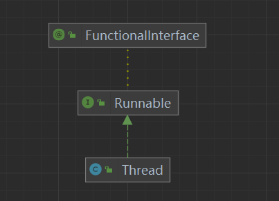
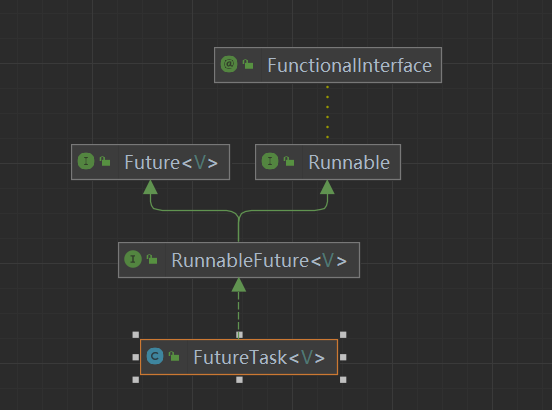
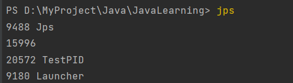
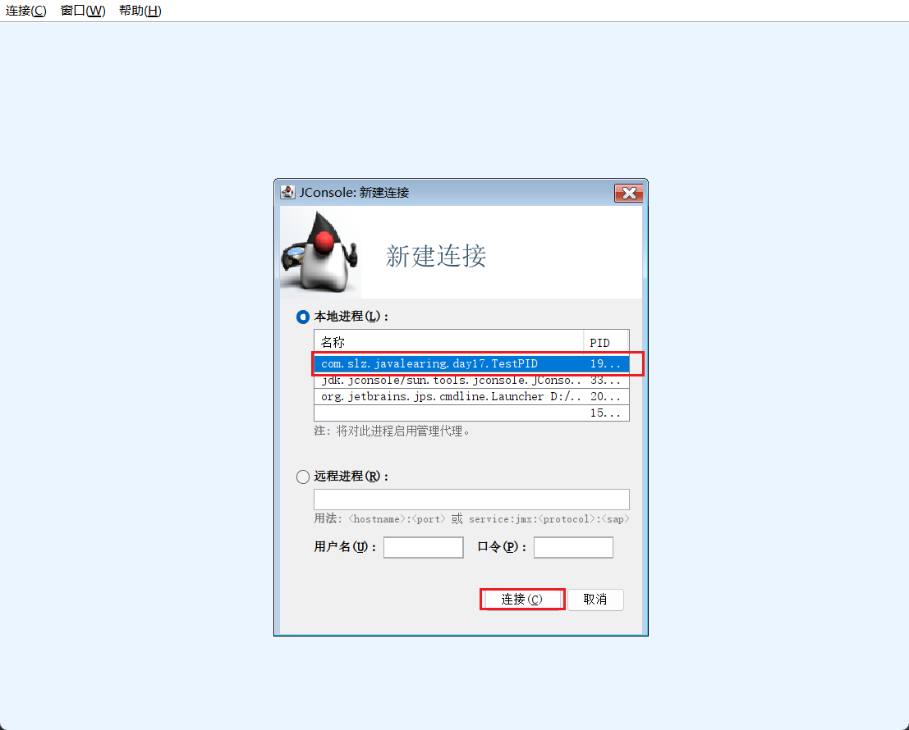
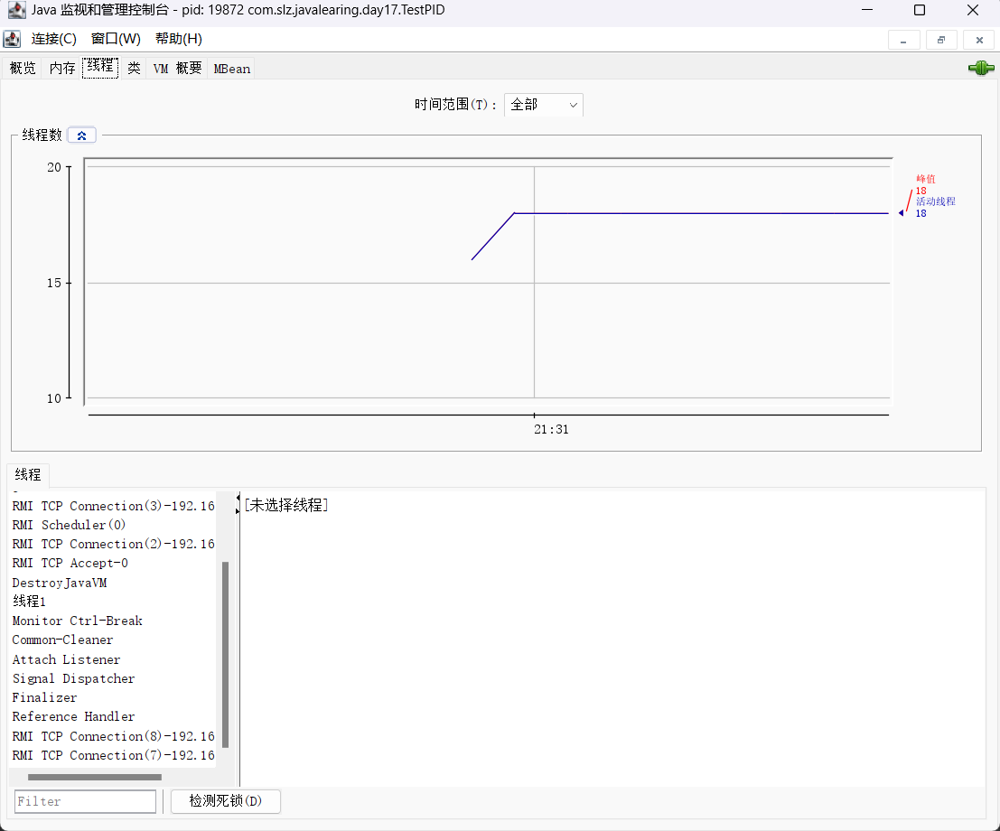
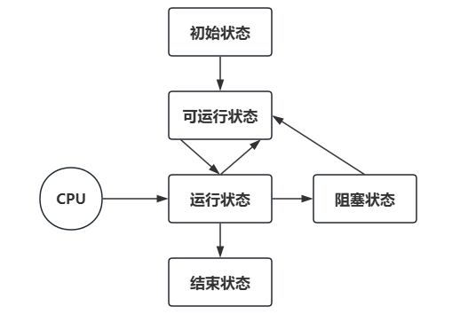
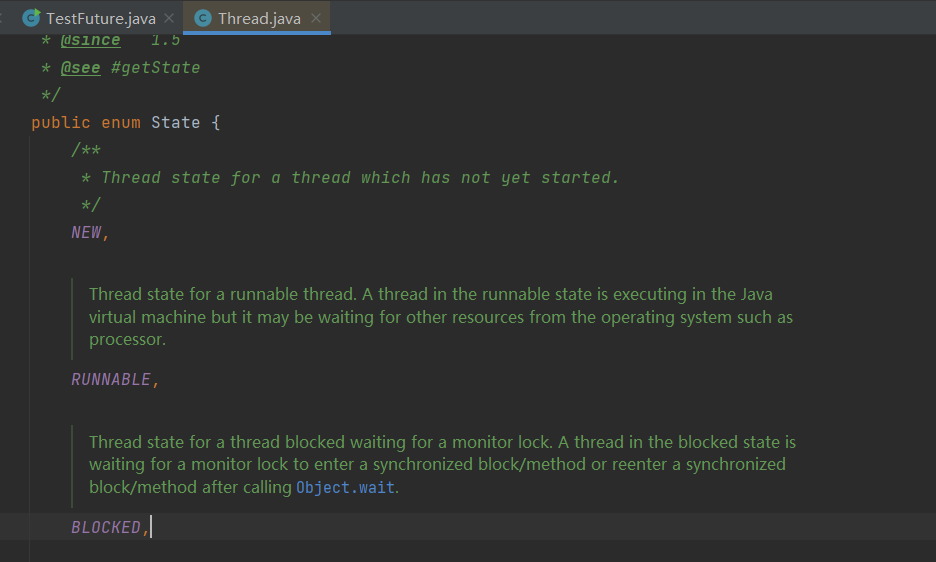
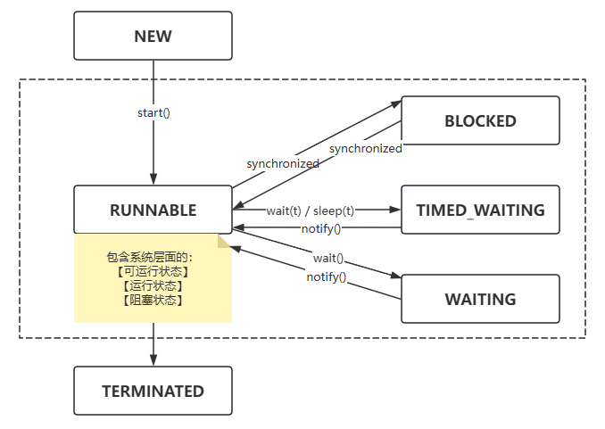

# 多线程

一、进程

- 程序由指令和数据组成，指令要运行，需要将指令加载到CPU中，数据加载到内存中。柱数据要读写，指令运行过程中，需要访问磁盘文件、网络设备等。进程就是用来加载指令、管理内存、管理IO操作。
- 进程是一个具有独立功能的程序，可以申请和使用系统资源，是一个动态的概念，当一个程序被运行从磁盘加载这个程序代码至内存中，此时，可以说开启了一个进程。
- 进程可以视作程序的一个实例。有一些程序可以同时运行多个实例进程，比如:记事本、浏览器、画图，有的程序只能启动一个实例进程，比如:电脑管家、360安全卫士等。

二、线程

- 一个进程之内可以分为一到多个线程；
- 一个线程就是一个指令流，将指令流中的一条条指令按照一定的顺序(顺序执行、选择执行、循环执行)，交给CPU执行；
- java中，线程是作为最小调度单位，进程作为资源分配的最小单位；
- 在windows系统中，进程是不活动的，只是作为线程的容器；

三、区别

> - 进程是负责加载管理资源的，线程是负责执行指令的。
> - 进程基本是相互独立的，线程存在于进程中，是进程一个子集。
> - 进程拥有共享的资源，如内存空间等，供内部的线程共享。
> - 进程间通信较为复杂
>   - 同一台计算机的进程通信IPC(Inter-process communication)
>   - 不同计算机之间的进程通信，需要通过网络，并且遵循共同的协议
> - 线程通信比较简单，因为线程具有共享进程内的内存。多个线程可以访问同一个共享变量，可以实现任务调度
> - 线程更轻量级，线程上下文切换成本要比进程上下文切换成本低进程是负责加载管理资源的，线程是负责执行指令的。

四、并行和并发

- 并发: 在单核CPU下，线程实际是以串行的方式执行操作系统中，有一个任务调度器组件，将cpu的时间片分给不同的程序使用。由于cpu时间片很短，切换速度非常快，使用户看起来，多个任务是同时运行的；
- 并行: 在多核CPU下，每个核都可以完成线程的执行；

# JUC

## 一、线程的创建和运行

### 1. 方法一: 继承Thread类，重写 run 方法



> Thread类, 实现了Runnable接口，调用时，调用线程的 start() 方法，自动执行 run() 方法;

```java
public class TestThread {
    public static void main(String[] args) {
        System.out.println("主线程开始执行");
        MyThread myThread01 = new MyThread();
        Thread myThread02 = new Thread(()->{ // 也可以用 匿名内部类 / lambda 表达式的创建线程
            System.out.println("子线程" + Thread.currentThread().getName() +"执行");
        });
        MyThread myThread03 = new MyThread();
        myThread01.setName("01");
        myThread02.setName("02");
        myThread03.setName("03");
        myThread01.start(); // 开启一个子线程，自动调用run方法
        myThread02.start();
        myThread03.start();
        System.out.println("主线程执行结束");

        new Thread(()->{
            System.out.println("lambda 创建的线程");
        }).start();
    }
}

class MyThread extends Thread {
    @Override
    public void run() {
        System.out.println("子线程" + Thread.currentThread().getName() +"执行");
    }
}
```

### 2. 方式二: 实现 Runnable 接口，重写 run 方法，配合 Thread

> 也可以用 【匿名内部类 / lambda 表达式】的创建线程；因为 Thread 的构造方法可以传入一个 Runnable 接口的实现类，所以可以使用【匿名内部类 / lambda 表达式】代替 Runnable 接口的实现类；

- 更推荐使用第二种方法，方法一把线程和任务合并在一起，方法二把线程和任务分开。❤️
- 使用 Runnable 更容易和线程池高级API配合，并且让类脱离了Thread继承体系。

```java
public class TestRunnable {
    public static void main(String[] args) {
        System.out.println("主线程开始");
        MyRunnableImpl myRunnable = new MyRunnableImpl();
//        myRunnable.run(); // 直接调用 run() 方法不会开辟子线程
        Thread thread = new Thread(myRunnable);
        thread.start(); // Runnable 实现类，需要借助 Thread 另外开启子线程
        Thread thread1 = new Thread(()->{
            System.out.println("子线程" + Thread.currentThread().getName() +"执行");
        });
        thread1.start();
        new Thread(()->System.out.println("子线程" + Thread.currentThread().getName() +"执行"), "hello").start(); // 第二个参数是线程的名字
        System.out.println("主线程结束");
    }
}
class MyRunnableImpl implements Runnable{

    @Override
    public void run() {
        System.out.println("子线程" + Thread.currentThread().getName() +"执行");
    }
}
```

### 3. 方式三：FutureTask 配合 Thread 和 Callable



> FutureTask 实现了 Future的子类接口，是 JDK1.5 引入的一个接口，用于异步获取结果；表示一个可能还没有完成的异步任务的结果，针对这个结果，可以添加回调处理，以便在任务执行成功或失败后作出相应的操作.

使用场景：执行一个长时间运行的任务，使用 Future 去执行，我们可以暂时去处理其他任务。等待长任务执行的结果，再做计算处理。

- 计算密集场景
- 处理大数据量
- 远程方法调用

接口中使用到的方法：

- boolean cancel(boolean): 取消任务；
- boolean isCancelled(): 判断任务在完成之前，是否取消；
- boolean isDone(): 任务是否完成。正常终止、异常或取消，都认为是任务完成；
- V get(): 获取计算结果；
- V get(long timeout,Timeunit unit): 获取计算结果，超时时间；

❤️ Callable 接口和 Runnable 接口区别:❤️

- Callable 的 call 方法具有返回值, Runnalbe 的 run 方法没有返回值；
- Runnable 方法是 run 方法作为线程运行任务的入口，Callable接口方法是 call 方法;
- call 方法抛出异常，run方法不抛出异常，实现callable接口，可以对线程运行任务的异常进行捕获，从而得知异常的原因;
- Callable 配合 Future 对象，获取异步计算的结果；
- Callable 是供给型函数式接口；

> FutureTask 构造时传入 Callable 接口的实现类，要求实现 call 方法，有返回值

```java
public class TestFuture {
    public static void main(String[] args) throws ExecutionException, InterruptedException, TimeoutException {
//        FutureTask<Integer> futureTask = new FutureTask<>(new Callable<Integer>() {
//            @Override
//            public Integer call() throws Exception {
//                int sum = 0, i=1;
//                while (i<=100){
//                    sum+=i;
//                    i++;
//                }
//                return sum;
//            }
//        });
        FutureTask<Integer> futureTask = new FutureTask<>(() -> {
            int sum = 0, i=1;
            while (i<=100){
                sum+=i;
                i++;
            }
            Thread.sleep(3000);
            return sum;
        });
        new Thread(futureTask).start();
//        Thread.sleep(2000);
//        futureTask.cancel(true);
        System.out.println(futureTask.isCancelled());
        System.out.println(futureTask.isDone());
        System.out.println(futureTask.get(20000, TimeUnit.MILLISECONDS));
    }
}
```

## 二、查看进程和线程的方法

> - windows: 【tasklist】 命令查看进程 【tasklist /？ 查看帮助】
> - windows：【taskkill /F /PID 进程pid号】 杀死进程
> - 【jps】: 查看所有java的进程 👍
> - 【jstack PID】: 查看进程信息，生成jvm当前时刻所有线程快照。👍
> - 【jconsole】: 以图形界面方式查看java进程中线程的运行状态 👍

```bash
PS D:\MyProject\Java\JavaLearning> taskkill /F /PID 19872
成功: 已终止 PID 为 19872 的进程。
```



```bash
PS D:\MyProject\Java\JavaLearning> jstack 19872
2024-06-28 21:28:33
Full thread dump OpenJDK 64-Bit Server VM (11.0.18+10-LTS mixed mode):

Threads class SMR info:
_java_thread_list=0x0000012d7d9889e0, length=12, elements={
0x0000012d7cd1d800, 0x0000012d7d5c3000, 0x0000012d7d630000, 0x0000012d7d631000,
0x0000012d7d634000, 0x0000012d7d635800, 0x0000012d7d636800, 0x0000012d7d638000,
0x0000012d7d5a0800, 0x0000012d7d92a000, 0x0000012d7d92e000, 0x0000012d5866f000
}

"Reference Handler" #2 daemon prio=10 os_prio=2 cpu=0.00ms elapsed=237.41s tid=0x0000012d7cd1d800 nid=0x84f0 waiting on condition  [0x0000000ddf6ff000]
   java.lang.Thread.State: RUNNABLE
        at java.lang.ref.Reference.waitForReferencePendingList(java.base@11.0.18/Native Method)
        at java.lang.ref.Reference.processPendingReferences(java.base@11.0.18/Reference.java:241)
        at java.lang.ref.Reference$ReferenceHandler.run(java.base@11.0.18/Reference.java:213)

"Finalizer" #3 daemon prio=8 os_prio=1 cpu=0.00ms elapsed=237.41s tid=0x0000012d7d5c3000 nid=0x5624 in Object.wait()  [0x0000000ddf7ff000]
   java.lang.Thread.State: WAITING (on object monitor)
        at java.lang.Object.wait(java.base@11.0.18/Native Method)
        - waiting on <0x0000000714308f98> (a java.lang.ref.ReferenceQueue$Lock)
        at java.lang.ref.ReferenceQueue.remove(java.base@11.0.18/ReferenceQueue.java:155)
        - waiting to re-lock in wait() <0x0000000714308f98> (a java.lang.ref.ReferenceQueue$Lock)
        at java.lang.ref.ReferenceQueue.remove(java.base@11.0.18/ReferenceQueue.java:176)
        at java.lang.ref.Finalizer$FinalizerThread.run(java.base@11.0.18/Finalizer.java:170)

"Signal Dispatcher" #4 daemon prio=9 os_prio=2 cpu=0.00ms elapsed=237.40s tid=0x0000012d7d630000 nid=0x801c runnable  [0x0000000000000000]
   java.lang.Thread.State: RUNNABLE

"Attach Listener" #5 daemon prio=5 os_prio=2 cpu=0.00ms elapsed=237.40s tid=0x0000012d7d631000 nid=0x6b5c waiting on condition  [0x0000000000000000]
   java.lang.Thread.State: RUNNABLE

"Service Thread" #6 daemon prio=9 os_prio=0 cpu=0.00ms elapsed=237.40s tid=0x0000012d7d634000 nid=0x74d0 runnable  [0x0000000000000000]
   java.lang.Thread.State: RUNNABLE

"C2 CompilerThread0" #7 daemon prio=9 os_prio=2 cpu=0.00ms elapsed=237.40s tid=0x0000012d7d635800 nid=0x81f0 waiting on condition  [0x0000000000000000]
   java.lang.Thread.State: RUNNABLE
   No compile task

"C1 CompilerThread0" #15 daemon prio=9 os_prio=2 cpu=0.00ms elapsed=237.40s tid=0x0000012d7d636800 nid=0x7e9c waiting on condition  [0x0000000000000000]
   java.lang.Thread.State: RUNNABLE
   No compile task

"Sweeper thread" #19 daemon prio=9 os_prio=2 cpu=0.00ms elapsed=237.40s tid=0x0000012d7d638000 nid=0x73f8 runnable  [0x0000000000000000]
   java.lang.Thread.State: RUNNABLE

"Common-Cleaner" #20 daemon prio=8 os_prio=1 cpu=0.00ms elapsed=237.35s tid=0x0000012d7d5a0800 nid=0x8478 in Object.wait()  [0x0000000ddfeff000]
   java.lang.Thread.State: TIMED_WAITING (on object monitor)
        at java.lang.Object.wait(java.base@11.0.18/Native Method)
        - waiting on <0x0000000714231900> (a java.lang.ref.ReferenceQueue$Lock)
        at java.lang.ref.ReferenceQueue.remove(java.base@11.0.18/ReferenceQueue.java:155)
        - waiting to re-lock in wait() <0x0000000714231900> (a java.lang.ref.ReferenceQueue$Lock)
        at jdk.internal.ref.CleanerImpl.run(java.base@11.0.18/CleanerImpl.java:148)
        at java.lang.Thread.run(java.base@11.0.18/Thread.java:829)
        at jdk.internal.misc.InnocuousThread.run(java.base@11.0.18/InnocuousThread.java:161)

"Monitor Ctrl-Break" #21 daemon prio=5 os_prio=0 cpu=15.63ms elapsed=237.31s tid=0x0000012d7d92a000 nid=0x7510 runnable  [0x0000000de03fe000]
   java.lang.Thread.State: RUNNABLE
        at java.net.SocketInputStream.socketRead0(java.base@11.0.18/Native Method)
        at java.net.SocketInputStream.socketRead(java.base@11.0.18/SocketInputStream.java:115)
        at java.net.SocketInputStream.read(java.base@11.0.18/SocketInputStream.java:168)
        at java.net.SocketInputStream.read(java.base@11.0.18/SocketInputStream.java:140)
        at sun.nio.cs.StreamDecoder.readBytes(java.base@11.0.18/StreamDecoder.java:284)
        at sun.nio.cs.StreamDecoder.implRead(java.base@11.0.18/StreamDecoder.java:326)
        at sun.nio.cs.StreamDecoder.read(java.base@11.0.18/StreamDecoder.java:178)
        - locked <0x00000007140061b8> (a java.io.InputStreamReader)
        at java.io.InputStreamReader.read(java.base@11.0.18/InputStreamReader.java:181)
        at java.io.BufferedReader.fill(java.base@11.0.18/BufferedReader.java:161)
        at java.io.BufferedReader.readLine(java.base@11.0.18/BufferedReader.java:326)
        - locked <0x00000007140061b8> (a java.io.InputStreamReader)
        at java.io.BufferedReader.readLine(java.base@11.0.18/BufferedReader.java:392)
        at com.intellij.rt.execution.application.AppMainV2$1.run(AppMainV2.java:56)

"线程1" #22 prio=5 os_prio=0 cpu=53343.75ms elapsed=237.31s tid=0x0000012d7d92e000 nid=0x5148 runnable  [0x0000000de05fe000]
   java.lang.Thread.State: RUNNABLE
        at com.slz.javalearing.day17.TestPID.lambda$main$0(TestPID.java:13)
        at com.slz.javalearing.day17.TestPID$$Lambda$14/0x0000000800066840.run(Unknown Source)
        at java.lang.Thread.run(java.base@11.0.18/Thread.java:829)

"DestroyJavaVM" #23 prio=5 os_prio=0 cpu=62.50ms elapsed=237.31s tid=0x0000012d5866f000 nid=0x7cb0 waiting on condition  [0x0000000000000000]
   java.lang.Thread.State: RUNNABLE

"VM Thread" os_prio=2 cpu=0.00ms elapsed=237.41s tid=0x0000012d7cd19800 nid=0x1974 runnable

"GC Thread#0" os_prio=2 cpu=0.00ms elapsed=237.43s tid=0x0000012d58689800 nid=0x76c0 runnable

"G1 Main Marker" os_prio=2 cpu=0.00ms elapsed=237.43s tid=0x0000012d586e7800 nid=0x5234 runnable

"G1 Conc#0" os_prio=2 cpu=0.00ms elapsed=237.43s tid=0x0000012d586e9000 nid=0x6bbc runnable

"G1 Refine#0" os_prio=2 cpu=0.00ms elapsed=237.42s tid=0x0000012d7cc01800 nid=0x6f58 runnable

"G1 Young RemSet Sampling" os_prio=2 cpu=0.00ms elapsed=237.42s tid=0x0000012d7cc04800 nid=0x5650 runnable
"VM Periodic Task Thread" os_prio=2 cpu=0.00ms elapsed=237.31s tid=0x0000012d7d92b000 nid=0x1910 waiting on condition

JNI global refs: 24, weak refs: 0

```





## 三、线程的状态

### 1. 操作系统层面划分: 五种状态

- 【初始状态】：在编程语言层面上创建了线程对象，还没有与操作系统线程关联；
- 【可运行状态】:当前线程已经与操作系统线程关联，可以由CPU调度执行；
- 【运行状态】:
  - 获取了CPU时间片，在运行中的状态；
  - 当cpu时间片用完后，会从运行状态切换回可运行状态，导致线程上下文切换；
- 【阻塞状态】：
  - 如果调用了阻塞的API应用，例如BIO读写文件。会导致线程上下文切换，进入阻塞状态；
  - 当BIO操作完成之后，由操作系统唤醒阻塞的线程，切换到可运行状态；
  - 对于阻塞线程来讲，只要不被唤醒，调度器就不会考虑调度它们执行；
- 【终止状态】：表示线程已经执行结束，生命周期全部执行完成，不会再转换为其它状态；



### 2. 编程言层面划分：六种状态



❤️ 根据 JavaAPI 中 Thread 类下的 State 枚举类型，分为以下六种状态：❤️

- 【NEW】: 表示线程刚刚创建对象，还没有调用 start() 方法；
- 【RUNNABLE】: 调用了 start() 方法，java 的 RUNNABLE 状态，包括了操作系统层面上可运行状态、运行状态和阻塞状态(BIO导致的线程阻塞，在java程序中无法区分，仍然认为是可运行状态)；
- 【BLOCKED、WAITING、TIMED_WAITING】: 都是在 Java 层面，对阻塞状态的细分情况；
- 【TERMINATED】: 当前线程执行结束；



### 3. 代码演示线程运行状态

- NEW、RUNNABLE、TERMINATED

```JAVA
public class TestThreadState {
    public static void main(String[] args) throws InterruptedException {
        System.out.println("主线程开始");
        Thread t1 = new Thread(()->{
            try {
                FileReader fileReader = new FileReader("javabase/resource/data.txt");
                BufferedReader bufferedReader = new BufferedReader(fileReader);
                String s;
                Integer flag = 0;
                while ((s=bufferedReader.readLine())!=null){
                    if(flag.equals(66)) {
                        System.out.println(Thread.currentThread().getState()); // 读取文件属于BIO阻塞，系统层面看线程是阻塞状态，但是JAVA层面线程是RUNNABLE状态
                    }
                    flag++;
                }
            } catch (IOException e) {
                throw new RuntimeException(e);
            }
        });
        System.out.println(t1.getState()); // 获取线程状态，NEW：创建了线程对象，但是没有调用start()方法
        t1.start();
        Thread.sleep(1000); // 等到子线程执行结束
        System.out.println(t1.getState()); // 子线程执行结束，线程状态是 TERMINATED
        System.out.println("主线程结束");
    }
}
```

- WAITING、TIMED_WAITING、BLOCKED

```java
public class TestThreadState2 {
    /*从Java 8开始，即便没有明确声明为final，只要在lambda表达式外部定义的变量在其赋值后不再有其他赋值操作，
    那么这个变量也被视为“有效地final”，可以在lambda表达式中使用。这意味着编译器会检查变量是否在赋值后不再改变，
    如果是，则允许在lambda中使用。*/
    public static void main(String[] args) throws InterruptedException {
        System.out.println("主线程开始");
        String lockedObject = "Give Me";
        Thread t1 = new Thread(()->{
            try {
                Thread.sleep(3000);
            } catch (InterruptedException e) {
                throw new RuntimeException(e);
            }
        });
        Thread t2 = new Thread(()->{
            try {
                t1.join(); // t2 线程等待 t1 线程结束，属于无限时等待状态
            } catch (InterruptedException e) {
                throw new RuntimeException(e);
            }
        });
        Thread t3 = new Thread(()->{
            synchronized (lockedObject){
                try {
                    Thread.sleep(1000);
                } catch (InterruptedException e) {
                    throw new RuntimeException(e);
                }
            }
        });
        Thread t4 = new Thread(()->{
            synchronized (lockedObject){
                try {
                    Thread.sleep(1000);
                } catch (InterruptedException e) {
                    throw new RuntimeException(e);
                }
            }
        });

        t1.start();
        t2.start();
        t3.start();
        t4.start();
        System.out.println("t3: " + t3.getState()); // 获取到锁时，处于 RUNNABLE 状态，否则属于 BLOCKED 阻塞态
        System.out.println("t4: " + t4.getState()); // 获取到锁时，处于 RUNNABLE 状态，否则属于 BLOCKED 阻塞态
        Thread.sleep(1000);
        System.out.println("t1: " + t1.getState()); // 子线程睡眠，处于 TIMED_WAITING 状态，限时等待状态
        System.out.println("t2: " + t2.getState()); // t2 线程等待 t1 线程结束，属于无限时等待状态 WAITING
        System.out.println("主线程结束");
    }
}
```

## 四、线程常用API

### 1. start & run

- start(): 启动一个新线程，在新的线程中运行 run() 方法中的代码。start() 方法让线程进入就绪，不一定会立即执行 run() 中代码，有可能CPU的时间片还没有分配给它。每个线程的start方法，只能调用一次。否则会出现 IlegalThreadStateException 异常;
- run(): 新线程启动后自动调用的方法。如果在构造 Thread 对象时，传递了 Runnable 参数，线程启动后会调用 Runnable 中的 run() 方法, 否则默认情况下，不执行任何操作。但可以创建Thread子类对象来重写 run() 方法;

> 区别: 直接调用 run() 方法，其实是在主线程中运行 run()，并没有启动新的线程，也没有开辟新的栈帧; 使用 start() 方法，启动新的线程，开辟了新的栈帧，通过新的线程去调用 run() 中的代码。

### 2. 线程优先级

线程优先级高的会提示任务调度器优先调度该线程：最大值10，最小值1，默认5；

- setPriority(): 设置线程优先级；
- getPriority(): 获取线程优先级；

```java
public class TestThreadAPI {
    public static void main(String[] args) {
        Thread t1 = new Thread(()->{});
        t1.start(); // start() 只能调用一次
//        t1.start(); // start() 只能调用一次
        // 线程优先级
        Thread t2 = new Thread(()->{
            int i=0;
            while(true){
                System.out.println(Thread.currentThread().getName() + ":" + i++);
            }
        }, "线程1");
        Thread t3 = new Thread(()->{
            int i=0;
            while(true){
                System.out.println("\t\t" + Thread.currentThread().getName() + ":" + i++);
            }
        }, "线程2");
        t2.setPriority(Thread.MIN_PRIORITY);
        t3.setPriority(Thread.MAX_PRIORITY);
        System.out.println(t1.getPriority());
        System.out.println(t2.getPriority());
        System.out.println(t3.getPriority());
        t2.start();
        t3.start();
    }
}
```

### 3. sleep & yield

- sleep(): 让出CPU，降低CPU使用频率
  - 调用 sleep 让线程休眠，会将当前线程从运行状态进入到 TIMED_WAITING 状态;
  - 其他线程可以打断正在睡眠的线程(interrupt), 在休眠的线程，被打断时，会抛出 InterruptedException;
  - 当线程休眠被打断，线程不一定会立即执行，需要获取CPU时间片；
  - 建议使用 TimeUnit 代替 Thread.sleep 方法，可读性更强；`TimeUnit.SECONDS.sleep(2);`

```java
public class TestThreadAPI2 {
    public static void main(String[] args) throws InterruptedException {
        System.out.println("主线程开始");
        Thread t1 = new Thread(()->{
            try {
                TimeUnit.SECONDS.sleep(3);
//                Thread.sleep(2000);
            } catch (InterruptedException e) {
                System.out.println("子线程被唤醒");
                System.out.println("4: " + Thread.currentThread().getState()); // 线程休眠被唤醒后. 跳过休眠，进入RUNNABLE状态
                throw new RuntimeException(e);
            }
            System.out.println("子线程结束");
        });
        System.out.println("1: " + t1.getState()); // NEW
        t1.start();
        TimeUnit.SECONDS.sleep(1);
        System.out.println("2: " + t1.getState()); // TIMED_WAITING
        t1.interrupt();
        t1.join();
        System.out.println("3: " + t1.getState()); // TERMINATED
        System.out.println("主线程结束");
    }
}
```

- yield(): 本地方法
  - 调用 yield 会让当前线程从运行状态，进入就绪状态，让出CPU，调度器执行其它线程。具体的实现依赖于操作系统的任务调度器；
  - 表示当前线程愿意让出CPU，但具体是否让出，要依据OS的任务调度器,可能出现让出CPU后，又立即获得CPU；
  - Thread.yield();

> 区别：
>
> - sleep 方法使用当前线程进入休眠状态，执行sleep的线程在指定的时间内，肯定不会被执行；
> - yield 方法，让当前线程从运行状态重新回到可执行状态，有可能在进入到可执行状态后，马上又被执；
> - sleep 方法，使当前线程休眠一段时间，进入不可运行状态，这段时间长短是由程序决定的；
> - yield 方法，让出CPU占有权，时间是不可设定的。

```java
public class TestYield {
    public static void main(String[] args) {
        Thread t1 = new Thread(()->{
            int i=0;
            while (true){
                Thread.yield();
                System.out.println("\t\t" + Thread.currentThread().getName() + ":" + i++);
            }
        }, "线程1");
        Thread t2 = new Thread(()->{
            int i=0;
            while (true){
                System.out.println(Thread.currentThread().getName() + ":" + i++);
            }
        }, "线程2");
        t1.start();
        t2.start();
    }
}
```

### 4. join

- join(): 等待加入的线程执行完成，才继续向下执行；
- join(t): 当前线程最多等待加入的线程t时间，要么join的线程终结，要么超时，都要继续向下执行；

```java
public class TestJoin {
    private static Integer x = 0;
    public static void main(String[] args) throws InterruptedException {
        Thread t1 = new Thread(()->{
            try {
                TimeUnit.SECONDS.sleep(2);
            } catch (InterruptedException e) {
                throw new RuntimeException(e);
            }
            x = 100;
        });
        t1.start();
//        t1.join();
        t1.join(2000);
        System.out.println(x);
    }
}
```

### 5. interruput ❤️

- 1. 打断 sleep、wait、join方法，处理阻塞状态的线程；会清空打断的状态，打断状态标记为 false； 👍
- 2. 打断正常运行的线程；不会清空打断状态，打断状态标记为 true； 👍
- isInterrupted(): 获取打断标记；

```java
public class TestInterruput {
    public static void main(String[] args) throws InterruptedException {
        // sleep wait join 被打断，打断标记会被清除
        Thread t1 = new Thread(()->{
            try {
                TimeUnit.SECONDS.sleep(2);
            } catch (InterruptedException e) {
                System.out.println(Thread.currentThread().getName() + ": 休眠被打断");
                System.out.println(Thread.currentThread().isInterrupted()); // 获取打断标记 fasle
                throw new RuntimeException(e);
            }
        }, "t1");
        t1.start();
        t1.interrupt();
        // 打断正常运行的线程，打断标记不会被清除
        Thread t2 = new Thread(()->{
            while (true){
                if(Thread.currentThread().isInterrupted()){ // 判断打断标记 true
                    System.out.println(Thread.currentThread().getName() + ": 正常运行被打断");
                    System.out.println(Thread.currentThread().isInterrupted());
                    break;
                }
            }
        }, "t2");
        t2.start();
        TimeUnit.SECONDS.sleep(1);
        t2.interrupt();
    }
}
```

### 6. 守护线程 👍

java程序中，有两种线程：


- 一种是用户线程 User Thread；
- 一种是守护线程 Daemon Thread 指的是程序运行时，在后台提供的一种通用服务线程；
- 当所有的用户线程结束时，守护线程也就终止了，同时会杀死进程中的所有守护线程；

setDaemon(true): 设置守护线程，如果参数为true，则将当前线程设置为守护线程，否则是用户线程；

> 应用场景：Java 垃圾回收；

```java
public class TestDaemon {
    public static void main(String[] args) {
        // 创建一个守护线程
        Thread daemonThread = new Thread(new Runnable() {
            @Override
            public void run() {
                while (true) {
                    try {
                        System.out.println("守护线程正在运行...");
                        // 让线程睡眠1秒，模拟执行任务
                        Thread.sleep(1000);
                    } catch (InterruptedException e) {
                        Thread.currentThread().interrupt(); // 保持中断状态
                        System.out.println("守护线程被中断");
                        return; // 结束线程
                    }
                }
            }
        }, "DaemonThread");

        // 设置为守护线程
        daemonThread.setDaemon(true);

        // 启动守护线程
        daemonThread.start();

        // 主线程任务
        for (int i = 0; i < 5; i++) {
            try {
                System.out.println("主线程正在运行...");
                Thread.sleep(500);
            } catch (InterruptedException e) {
                Thread.currentThread().interrupt();
                e.printStackTrace();
            }
        }

        System.out.println("主线程结束，守护线程也将随之结束。");
    }
}
```
