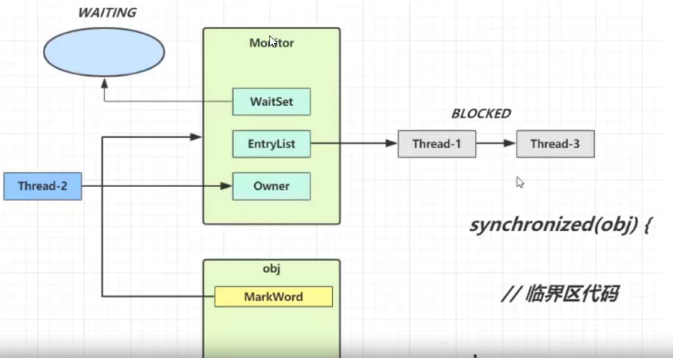
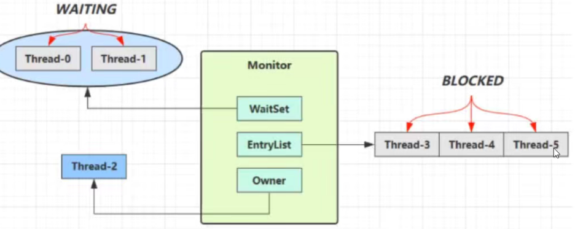
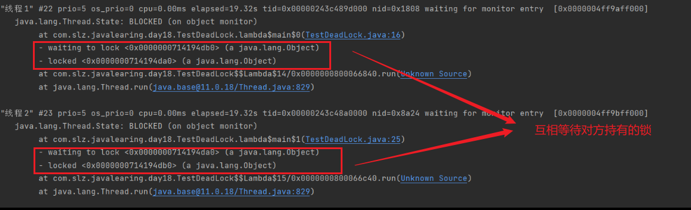
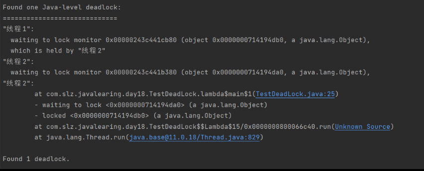
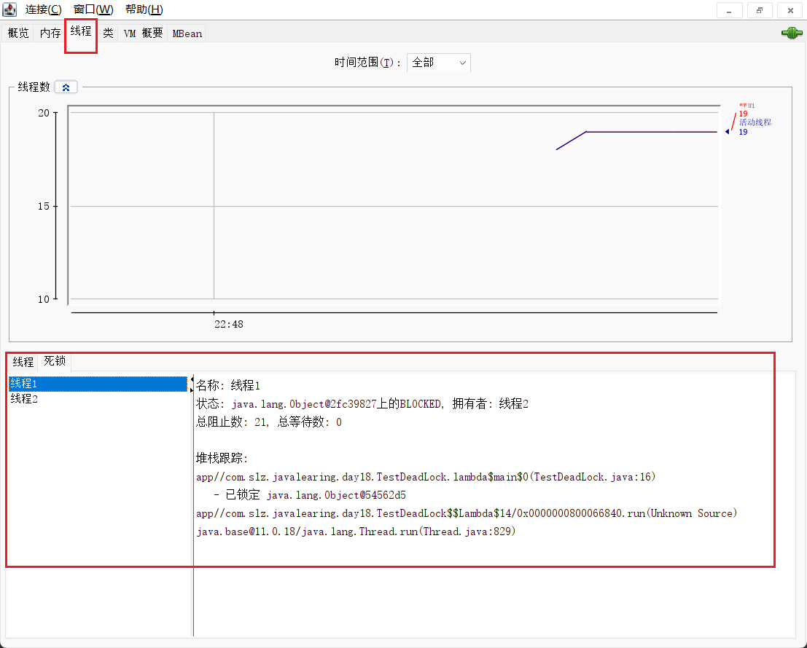
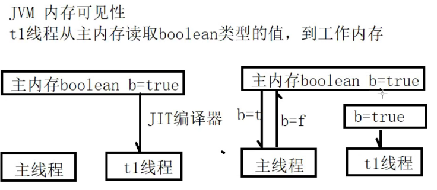

## 一、数据共享问题

```java
public class TestShareVar {
    public static int  x = 0;
    public static void main(String[] args) throws InterruptedException {
        Thread t1 = new Thread(()->{
            for (int i = 0; i < 10000; i++) {
                x++;
            }
        });
        Thread t2 = new Thread(()->{
            for (int i = 0; i < 10000; i++) {
                x--;
            }
        });
        t1.start();
        t2.start();
        t1.join();
        t2.join();
        System.out.println(x); // 每次运行结果是不确定的
    }
}
```

在执行x++指令时，会生成的字节码如下：

```apache
getstatic        #2//获取静态变量x的值
iconst_1           //准备常量 1
iadd               //自增
putstatic       #2 // 将修改后的值存入静态变量中
```

在执行x--指令时，会生成的字节码如下：

```apache
getstatic        #2//获取静态变量x的值
iconst_1           //准备常量 1
iadd               //自减
putstatic       #2 // 将修改后的值存入静态变量中
```

> 当两个线程在CPU上交替执行时，对于同一个资源可能出现未操作完成就发生切换，因此导致不一致的问题；

### 1. 临界区

❤️ 临界区: 一段代码块中间，如果存在对共享资源的多线程读写操作，这段代码块称为临界区；❤️

当一个对象或者一个不同步的共享状态，被两个或两个以上线程同时修改时，对访问顺序必须严格执行，则会产生竞态条件。

### 2. synchronized

对象锁的概念，采用互斥的方式，让同一时间点最多只能有一个线程持有锁，其他线程想获取这个锁的时候，就会发生阻塞，就可以保护当前拥有锁的线程可以安全的执行临界区中的代码，不需要处理上下文切换，导致的问题。

- 语法

  - 锁对象

    ```java
    synchronized(对象){
        // 临界区代码
    }
    ```

    ```java
    public class TestSync {
        public static int  x = 0;
        public static void main(String[] args) throws InterruptedException {
            Thread t1 = new Thread(()->{
                   for (int i = 0; i < 10000; i++) {
                       synchronized (Test.class){ // 加锁
                            x++;
                       }
                   }
            });
            Thread t2 = new Thread(()->{
                for (int i = 0; i < 10000; i++) {
                    synchronized (Test.class){ // 加锁
                        x--;
                    }
                }
            });
            t1.start();
            t2.start();
            t1.join();
            t2.join();
            System.out.println(x); // 每次运行结果是不确定的
        }
    }

    ```
  - 锁方法

    - 锁实例方法：

      ```java
          public void increment(){ 
              synchronized (this){ // this 代表当前类实例对象
                  this.x++;
              }
          }
          // 相当于
          public synchronized void decrement(){ 
              this.x--;
          }
      ```
    - 锁类方法：

      ```java
          public synchronized static void test(){
          }
          // 相当于
          public static void test1(){
              synchronized (NumObj.class){ // 在static 方法中，不能使用this
              }
          }
      ```
- synchronized 字节码

> java -c .class文件 【查看字节码】

```java
PS D:\MyProject\Java\JavaLearning\out\production\javabase\com\slz\javalearing\day18> javap -c .\TestShareVar.class
Compiled from "TestShareVar.java"
public class com.slz.javalearing.day18.TestShareVar {
  public static int x;

  public com.slz.javalearing.day18.TestShareVar();
    Code:
       0: aload_0
       1: invokespecial #1                  // Method java/lang/Object."<init>":()V
       4: return

  public static void main(java.lang.String[]) throws java.lang.InterruptedException;
    Code:
       0: new           #2                  // class java/lang/Thread
       3: dup                               // 将上面对象复制
       4: invokedynamic #3,  0              // InvokeDynamic #0:run:()Ljava/lang/Runnable;
       9: invokespecial #4                  // Method java/lang/Thread."<init>":(Ljava/lang/Runnable;)V
      12: astore_1                          // 将 obj 对象引用存储到临时变量中 s1ot 1 中
      13: new           #2                  // class java/lang/Thread
      16: dup
      17: invokedynamic #5,  0              // InvokeDynamic #1:run:()Ljava/lang/Runnable;
      22: invokespecial #4                  // Method java/lang/Thread."<init>":(Ljava/lang/Runnable;)V
      25: astore_2
      26: aload_1
      27: invokevirtual #6                  // Method java/lang/Thread.start:()V
      30: aload_2
      31: invokevirtual #6                  // Method java/lang/Thread.start:()V
      34: aload_1
      35: invokevirtual #7                  // Method java/lang/Thread.join:()V
      38: aload_2
      39: invokevirtual #7                  // Method java/lang/Thread.join:()V
      42: getstatic     #8                  // Field java/lang/System.out:Ljava/io/PrintStream;
}

```

### 3. Monitor ❤️

> Moninter 可理解为 监视器 或叫作 管程

每个 java 对象都可以关联一个 Monitor 对象，如果 使用 synchronized 给对象加锁，对象头的 markword 中，被设置为指向 Monitor 对象的指针；





### 4. wait & notify 线程通信

如上图所示：

- Owner 线程发现条件不满足，调用 wait 方法，进入 waitSet，变成 WAITING 状态；
- BLOCKED 和 WAITING 的状态下的线程，不占用CPU时间片；
- BLOCKED 线程在 Owner 线程释放锁时被唤醒；
- WAITING 线程在 Owner 线程调用 notify 或者 notifyAll 方法时，被唤醒。唤醒后不代表可以立刻获得锁，需要进入EntryList重新竞争；

方法的使用：❤️

- wait() 方法，让进入监视器的线程到 waitset 中等待；
- notify() 方法，在obj监视器上正在 waitset 等待的线程中选择一个激活；
- notifyAll() 方法，在obj监视器上，所有 waitset 等待的线程全部激活；

> 都属于 Object 类的方法，必须要求获得对象的锁，才能使用。❤️

```java
public class TestWaitNotify {
    private static final Object obj_lock = new Object();
    public static void main(String[] args) throws InterruptedException {
        Thread t1 = new Thread(()->{
            synchronized (obj_lock){
                try {
                    System.out.println("线程1等待..." );
                    obj_lock.wait(); // 线程1进入 waitset 等待，直到被其他线程唤醒
                } catch (InterruptedException e) {
                    throw new RuntimeException(e);
                }
                System.out.println("线程1被唤醒后继续执行");
            }
        });
        Thread t2 = new Thread(()->{
            synchronized (obj_lock){
                try {
                    System.out.println("线程2等待...");
                    obj_lock.wait(2000); // // 线程1进入 waitset 等待，直到被其他线程唤醒，或者等待时间过去
                } catch (InterruptedException e) {
                    throw new RuntimeException(e);
                }
                System.out.println("线程2被唤醒后继续执行");
            }
        });
        t1.start();
        t2.start();
        TimeUnit.SECONDS.sleep(1);
        synchronized (obj_lock){
            System.out.println("t1: " + t1.getState());
            System.out.println("t2: " + t2.getState());
            obj_lock.notifyAll(); // 主线程获取到锁，并唤醒 waitset 中的所有线程
//            obj_lock.notify(); // 主线程获取到锁，并唤醒 waitset 中的某个线程
            System.out.println("主线程唤醒waitset中的所有线程");
        }
    }
}
```

### 5. wait & sleep 的区别  ❤️

- sleep 是 Thread 类的静态方法，wait 是 Object 类的方法;
- sleep 是不需要和 synchronized 配合使用的，wait 是需要和 synchronized 配合使用的; 👍
- sleep 在执行方法时，进入休眠状态，不会释放对象锁，wait方法进入等待，会释放对象锁; 👍
- sleep 和 wait 状态都是 TIMED_WAITING;

```java
public class TestSleepWait {
    private static final Object obj_lock = new Object();
    public static void main(String[] args) {
        Thread t1 = new Thread(()->{
            try {
                synchronized (obj_lock){
                    System.out.println("线程1 休眠...");
//                    Thread.sleep(20000); // sleep 不会释放对象锁
                    obj_lock.wait(2000); // wait 会释放对象锁
                }
            } catch (InterruptedException e) {
                throw new RuntimeException(e);
            }
            System.out.println("线程1 结束执行");
        });
        Thread t2 = new Thread(()->{
            synchronized (obj_lock){
                System.out.println("线程2 获取到锁并执行");
            }
        });
        t1.start();
        t2.start();
    }
}
```

### 6. wait & notify 使用方式

> 当有多个线程,获取锁并等待满足条件时;

```java
synchronized (obj_lock){ // 等待条件
      while (!condition1){
      obj_lock.wait(); // 条件不满足,进入等待,释放锁
      }
      // 条件满足, 继续执行
}

synchronized (obj_lock){ // 设置条件
      condition = true;
      obj_lock.notifyAll(); // 唤醒所有线程,notify 会随机唤醒,但可能并不是目标线程(虚假唤醒),所以这里使用notifyAll
}
```

```java
public class TestWaitNotifyUse {
    private static final Object obj_lock = new Object();
    private static Boolean condition1 = false;
    private static Boolean condition2 = false;
    public static void main(String[] args) throws InterruptedException {
        new Thread(()->{
            synchronized (obj_lock){
                while (!condition1){
                    try {
                        System.out.println(Thread.currentThread().getName() + "条件不满足, 进入等待...");
                        obj_lock.wait();  // 进入等待,并释放锁
                    } catch (InterruptedException e) {
                        throw new RuntimeException(e);
                    }
                }
                System.out.println(Thread.currentThread().getName() + "条件满足, 执行完毕!");
            }
        }, "线程1").start();
        new Thread(()->{
            synchronized (obj_lock){
                while (!condition2){
                    try {
                        System.out.println(Thread.currentThread().getName() + "条件不满足, 进入等待...");
                        obj_lock.wait(); // 进入等待,并释放锁
                    } catch (InterruptedException e) {
                        throw new RuntimeException(e);
                    }
                }
                System.out.println(Thread.currentThread().getName() + "条件满足, 执行完毕!");
            }
        }, "线程2").start();
        TimeUnit.SECONDS.sleep(1); // 主线程休眠
        new Thread(()->{ // 使得条件一满足
            synchronized (obj_lock){ // 要使用 notifyAll / notify 需要使用 synchronized 获得锁
                condition1 = true;
                System.out.println("condition1 置为 true");
                obj_lock.notifyAll();
            }
        }).start();
        TimeUnit.SECONDS.sleep(1); // 主线程休眠
        new Thread(()->{ // 使得条件二满足
            synchronized (obj_lock){ // 要使用 notifyAll / notify 需要使用 synchronized 获得锁
                condition2 = true;
                System.out.println("condition2 置为 true");
                obj_lock.notifyAll();
            }
        }).start();
    }
}
```

### 7. 死锁

> 一个线程如果需要同时获取多把锁，容易发生死锁问题: 两个线程互相持有对方需要的锁;❤️

```java
public class TestDeadLock {
    private static final Object obj1 = new Object();
    private static final Object obj2 = new Object();
    public static void main(String[] args) {
        new Thread(()->{
            synchronized (obj1){
                System.out.println(Thread.currentThread().getName() + "获取到条件1");
                synchronized (obj2){
                    System.out.println(Thread.currentThread().getName() + "获取到条件2");
                }
            }
            System.out.println(Thread.currentThread().getName() + "满足所有条件, 可以执行");
        }, "线程1").start();
        new Thread(()->{
            synchronized (obj2){
                System.out.println(Thread.currentThread().getName() + "获取到条件2");
                synchronized (obj1){
                    System.out.println(Thread.currentThread().getName() + "获取到条件1");
                }
            }
            System.out.println(Thread.currentThread().getName() + "满足所有条件, 可以执行");
        }, "线程2").start();
    }
}
```

#### (1) jps + jstack 查看线程状态, 找到死锁位置 ❤️





#### (2) jconsole 查看死锁线程



#### (3) 死锁的四个条件 ❤️

- 互斥条件: 一个资源每次只能被一个进程使用;
- 请求与保持条件: 一个线程因请求资源而阻塞时，对已获得的资源保持不放;
- 不剥夺条件: 当前线程已获得的资源，在没有使用完之前，不能强行剥夺;
- 循环等待条件: 若干线程之间形成一种头尾相连的循环等待资源关系;

#### (4) 死锁处理 ❤️

- 预防死锁: 破坏四个条件中的一个，不能破坏互斥条件，其他三个可以破坏;
- 避免死锁: 在资源动态分配过程中，使用某种方式阻止系统进入不安全状态;
- 检测死锁: 允许系统在运行过程中发生死锁，可以设置检测操作对死锁的发生进行检测，并采用相关措施去清除;
- 解除死锁: 采用资源剥夺法，撤销进程法，进程回退法等，将进程从死锁状态解脱出来;

### 8. volatile 关键字使用 👍

- 使用 volatile 修饰变量 volatile 是一个关键字，用来修饰变量，表示变量不可以被某些编译器因为一些未知因素改变;
- 使用该关键字，可使编译器不再对这个变量进行优化，保证访问的稳定性;
- 变量必须到主内存中进行读取，不在工作内存中进行缓存;



> 由于编译器的优化处理,线程读取变量值时会拷贝一份到自己的工作内存中,若此时其它线程修改了该变量的值,线程市不知道的.
>
> 因此,使用 volatile 关键字的变量,不再在工作内存中保存副本,而直接从主内存读取变量值,保证了变量值的可见性.

```java
public class TestVolatile {
    private volatile static Boolean b = true; // 设置 volatile 保证可见性,(直接从主内存读取变量值)
    public static void main(String[] args) throws InterruptedException {
        new Thread(()->{
            System.out.println("子线程开始执行");
            while (b){
//                System.out.println("子线程正在执行...");
                // 打印操作（特别是System.out.println）通常涉及I/O操作，
                // 这类操作通常是耗时的，可能导致当前执行打印的线程被挂起，从而让出CPU给其他线程。
                // 这种上下文切换为其他线程提供了执行的机会，包括修改共享变量的线程，因此可能帮助暴露或解决了原本由于缺乏适当同步而隐藏的问题。
            }
            System.out.println("子线程执行结束");
        }).start();
        TimeUnit.SECONDS.sleep(2);
        b = false;
        System.out.println("主线程设置b=false");
    }
}

```

### 9. ThreadLocal 线程变量

> ThreadLocal 称作线程变量.

- 意思是 ThreadLocal 中填充的变量属于当前线程，该变量对于其他线程来讲是互相隔离的，这个变量是当前线程独有的变量。
- ThreadLocal 变量在每个线程中都创建一个副本，这样每个线程可以访问自己内部的副本变量。
- 减少同一个线程内多个函数或组件之间一些公共变量来回传递的复杂度。

注意：❤️

- 每个 Tread 内有自己的实例副本，这个副本只能由当前Thread使用;
- 不存在多线程间共享数据的问题;
- 通常被 private static 修饰，当一个线程结束时，它所使用的所有 ThreadLocal 的副本都可以被回收;

应用场景：

> - 线程并发场景: 不适用于单线程，适用于多线程并发；
> - 传递数据场景: 可以通过 ThreadLocal 在同一线程，多个不同组件中传递公共变量；
> - 线程隔离场景: 每个线程的变量都是独立的，互不影响；

> ```java
> class DataB{
>     private ThreadLocal<String> val = new ThreadLocal<>();
>     public String getVal() {
>         return this.val.get();
>     }
>     public void setVal(String val) {
>         this.val.set(val);
>     }
> }
> ```

#### (1) ThreadLocal 和 synchronized 的区别 👍 

- synchronized 用于线程间的数据共享，而 ThreadLocal 用于线程间的数据隔离;
- synchronized 是利用锁的机制，使用变量或代码块在某一时间点只能被一个线程访问。
- ThreadLocal 为每一个线程都提供了变量的副本，使得每个线程在某一时间点访问到的并不是同一个对象，就实现了隔离多个线程对数据的共享。


👍 应用优点:

- 传递数据，保证每个线程绑定的数据，在需要的地方直接获取，避免参数直接传递带来的代码耦合问题；
- 线程隔离，数据之间相互隔离，同时又可以并发，避免使用锁的机制带来的性能损失；

```java
public class TestThreadLocal {
    public static void main(String[] args) throws InterruptedException {
        DataA dataA = new DataA();
        testNoTheadLocal(dataA);
        TimeUnit.SECONDS.sleep(1);
        System.out.println("------------");
        DataB dataB = new DataB();
        testUseThreadLocal(dataB);
    }

    public static void testNoTheadLocal(DataA dataA){
        for (int i = 0; i < 5; i++) {
            new Thread(()->{
                try {
                    dataA.setVal(Thread.currentThread().getName());
                    TimeUnit.MILLISECONDS.sleep(50);
                    System.out.println(Thread.currentThread().getName() + ":" + dataA.getVal());
                } catch (InterruptedException e) {
                    throw new RuntimeException(e);
                }
            }).start();
        }
    }
    public static void testUseThreadLocal(DataB dataB){
        for (int i = 0; i < 5; i++) {
            new Thread(()->{
                try {
                    dataB.setVal(Thread.currentThread().getName());
                    TimeUnit.MILLISECONDS.sleep(50);
                    System.out.println(Thread.currentThread().getName() + ":" + dataB.getVal());
                } catch (InterruptedException e) {
                    throw new RuntimeException(e);
                }

            }).start();
        }
    }
}

class DataA{
    private String val;
    public String getVal() {
        return val;
    }
    public void setVal(String val) {
        this.val = val;
    }
}

class DataB{
    private ThreadLocal<String> val = new ThreadLocal<>();
    public String getVal() {
        return this.val.get();
    }
    public void setVal(String val) {
        this.val.set(val);
    }
}
```

### 10. 线程安全的类

- String
- Integer
- StringBuffer
- Random
- Vector
- Hashtable
- JUC: java.util.concurrent 包下的类

变量的线程安全：


