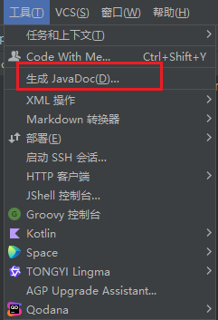
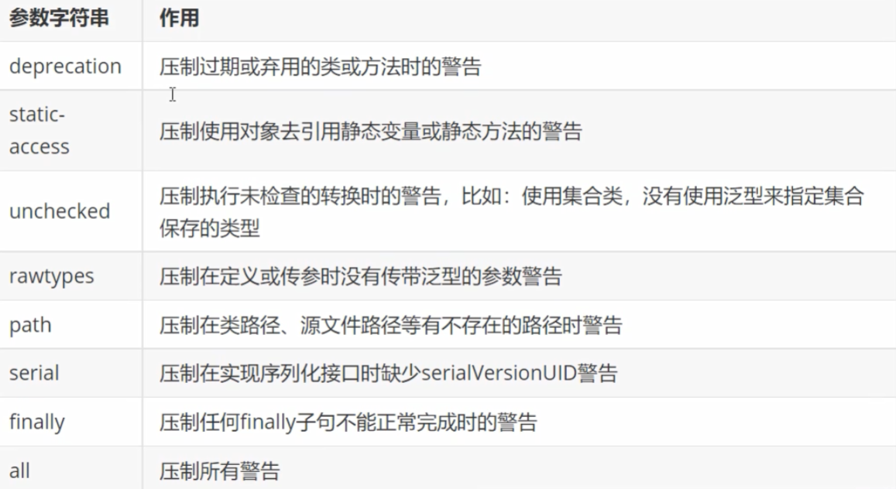
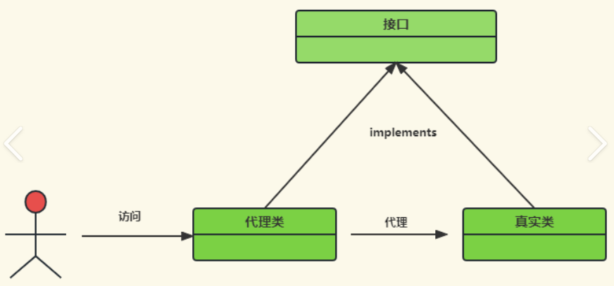
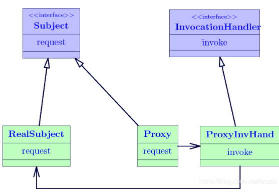

# 动态代理

## 一、注解

Annotation(注解): 是 JDK5 开始引入的新特性，可以看作是一种特殊的注释，主要用于修饰类、方法或者变量，在框架中大量使用。

- 注解是一种能被添加到 java 代码中的元数据，包、类、字段、方法、局部变量、方法参数都可以用注解来修饰，注解对于它所修饰的代码并没有直接的影响。

### 1. 应用




#### (1) 生成文档：生成文档是最常见的，也是java最早提供的注解;

```java
package com.slz.javalearing.day22;

/**
 * @author SunLZ
 * @since 1.8
 * @version 1.0
 */
public class Speaker {
    /**
     * @param x 输入参数
     * @return 返回值
     */
    public int test(int x){
        return x;
    }
}
```

#### (2) 编译时进行格式检查

> 例如：@override：放在方法前面，如果这个方法并不是覆盖类方法，则编译时就会检查报错；又如：@FunctionalInterface：函数式接口；

#### (3) 跟踪代码依赖性，实现替代配置文件的功能

> - 比较常见 spring、mybatis 开源框架，使用注解作用就是减少配置;
> - 在反射的Class，Method，Field这些方法中，有许多使用 Anhotation 的相关处理;

### 2. 注解分类

- 内置注解
- 元注解
- 自定义注解

#### (1) 内置注解

- @Override: 表示当前的方法定义将会覆盖父类中的方法，如果拼写错误或者方法签名不匹配，编译器就会提示出错。Retention 级别 RetentionPolicy.SOURCE；
- @Deprecated: 作用是对不应该再使用的类、类成员、方法添加注解，标明已经废弃（仍可调用）、过时了，不应该再使用。当编程人员在使用这些方法时，将会在编译器上显示过时信息提示；它和javadoc中的 @deprecated 标记具有相同的功能。
- @SuppressWarnings: 关闭对类、方法、成员编译时产生的特定警告;

  ```java
  //    @SuppressWarnings({"static-access"}) // 抑制实例对象访问静态方法的警告
   @SuppressWarnings("all") // 抑制所有警告
      public static void main(String[] args) {
          test1(); // 标记被弃用，但仍然可以调用
          T t = new T();
          t.test(); // 实例对象访问静态方法有警告
      }
  ```



- @FunctionalInterface：用来定义一个函数式接口，如果在接口中有超过一个以上的抽象方法，则报错；

#### (2) 自定义注解

```java
public @interface Anno1 {
}
```

- 格式：

> <元注解>
>
> public @interface <注解名>{}

- 使用方式：@注解名；
- 本质：是一个接口，类似于新创建一个接口文件，但是为了与接口区分，声明为 @interface，注解文件反编译后实际上就是一个继承自 Annotation 类的一个接口；

> PS D:\MyProject\Java\JavaLearning> javap D:\MyProject\Java\JavaLearning\out\production\javabase\com\slz\javalearing\day22\Anno1.class
> Compiled from "Anno1.java"
> public interface com.slz.javalearing.day22.Anno1 extends java.lang.annotation.Annotation {
> }

❤️ 定义规则：

- 在定义注解时，不能继承其他的注解或接口。
- @interface 用来声明一个注解，其中的每一个方法实际上声明了一个配置参数。
  - 方法默认 `public abstract`;
  - 方法不能有参数，也没有方法体；
- 方法的名称，就是参数的名称，方法的返回值类型，就是参数的类型；
- 返回值类型只能是：
  - String；
  - 八种基本数据类型；
  - Class<?> 类型；
  - 枚举类型；
  - Annotation 类型；
  - 以及以上所有类型的数组；
- 不允许 void 方法存在；
- 定义了方法的类型，在使用时要给赋值，也可以在定义时使用 default 给赋默认值；
- 如果只有一个参数成员，一般参数名为value，这时value可以不显式地写出来；

```java
public @interface Anno1 {
    String hello() default "sb"; // 使用注解时的一个配置参数，方法的名称，就是参数的名称，方法的返回值类型，就是参数的类型
    int hello1() default 0;
    Class<?> hello2() default String.class;

    Anno2 hello4() default @Anno2;
    int[] hello5() default {};
    Gender hello3() default Gender.WOMAN;

}
enum Gender{
    MAN, WOMAN
}

public @interface Anno2  {
}
```


#### (3) 元注解

- @Target: 用于定义注解修饰的目标，指定了目标后，自定义的注解就可以声明在目标上; 该注解可以接收一个数组，因此可以接收多个常量值，已有的常量都是定义在ElementType中。

  ```java
  public enum ElementType {
      /** Class, interface (including annotation type), or enum declaration */
      TYPE,

      /** Field declaration (includes enum constants) */
      FIELD,

      /** Method declaration */
      METHOD,

      /** Formal parameter declaration */
      PARAMETER,

      /** Constructor declaration */
      CONSTRUCTOR,

      /** Local variable declaration */
      LOCAL_VARIABLE,

      /** Annotation type declaration */
      ANNOTATION_TYPE,

      /** Package declaration */
      PACKAGE,

      /**
       * Type parameter declaration
       *
       * @since 1.8
       */
      TYPE_PARAMETER,

      /**
       * Use of a type
       *
       * @since 1.8
       */
      TYPE_USE,

      /**
       * Module declaration.
       *
       * @since 9
       */
      MODULE
  }
  ```
- @Documented: 用来做标识，使用了该注解，在生成 javaDoc 文档的时候，就会把 @Documented 注解标识的显示出来；
- @Inherited: 如果某个注解是被标注了 Inherited，表明可以被继承。如果一个使用 @Inherited 修饰的 annotation 类型（一般指注解）被用于一个类，则这个 annotation 将被用于该类的子类。

  - 当父类中的注解被 @Inherited 标注，会有如下情况：
    - 如果父类的注解是定义在类上面的，子类是可以继承过来的；
    - 如果父类的注解是定义在方法上面的，子类直接继承了父类的方法，则注解是可以继承过来的；
    - 如果父类的注解是定义在方法上面的，子类重写了父类定义了注解的方法，则子类将无法继承父类方法的注解，将方法连带上面的注解一并覆盖掉；
- @Retention，用于指定注解的生命周期，

  ```java
  public enum RetentionPolicy {
      /**
       * Annotations are to be discarded by the compiler.
       */
      SOURCE,

      /**
       * Annotations are to be recorded in the class file by the compiler
       * but need not be retained by the VM at run time.  This is the default
       * behavior.
       */
      CLASS,

      /**
       * Annotations are to be recorded in the class file by the compiler and
       * retained by the VM at run time, so they may be read reflectively.
       *
       * @see java.lang.reflect.AnnotatedElement
       */
      RUNTIME
  }
  ```
- RetentionPolicy.SOURCE：注解仅存在于源代码中，编译器会在编译完成后丢弃这些注解，这意味着它们不会出现在编译后的字节码中，也无法在运行时通过反射访问。
- RetentionPolicy.CLASS：注解会被编译器记录在类文件中，但默认情况下，虚拟机在运行时不会保留这些注解。这是大多数注解的默认行为，适用于那些需要在编译阶段进行处理（例如，代码生成或静态分析）但不需要在运行时存在的场景。
- RetentionPolicy.RUNTIME：注解不仅会被编译器记录在类文件中，而且会被虚拟机在运行时保留，因此可以通过反射机制读取这些注解。这对于那些需要在运行时动态获取注解信息的应用场景非常有用，例如框架或库可能需要根据类上的注解来决定如何处理这些类。


❤️ 通过注解获取配置信息

```java
@Config(className = "com.slz.javalearing.day22.Player", propertyName = "name", propertyValue = "傻逼")
public class TestConfig {
    public static void main(String[] args) throws ClassNotFoundException, NoSuchMethodException, InvocationTargetException, InstantiationException, IllegalAccessException, NoSuchFieldException {
        Class<TestConfig> testConfigClass = TestConfig.class;
        Config annotation = testConfigClass.getAnnotation(Config.class);
        String className = annotation.className();
        String propertyName = annotation.propertyName();
        String propertyValue = annotation.propertyValue();

        Class<?> aClass = Class.forName(className);
        Field field = aClass.getDeclaredField(propertyName);
        field.setAccessible(true);
        Object o = aClass.getConstructor().newInstance();
        field.set(o, propertyValue);

        System.out.println(o);

    }
}

public class Player {
    private String name;

    @Override
    public String toString() {
        return "Player{" +
                "name='" + name + '\'' +
                '}';
    }
}

@Target({ElementType.TYPE}) // 可以使用在类、接口、枚举上
@Retention(RetentionPolicy.RUNTIME) // 运行时保留，因此可以通过反射机制读取这些注解
public @interface Config {
    String className();
    String propertyName();
    String propertyValue();
}
```


## 二、动态代理



静态代理：

> 静态代理是一种设计模式，常用于面向对象编程中，特别是在Java中。这种模式允许你创建一个对象，这个对象具有与另一个对象相同的接口，这样代理对象就可以控制对原始对象的访问。
>
> - 静态代理通常在编译时就已经确定，而不是在运行时动态生成。
> - 静态代理的组成部分：
>   - 接口（Interface）：定义了代理对象和真实对象共同遵守的契约。
>   - 真实主题（Real Subject）：实现了接口，是最终要完成任务的对象。
>   - 代理主题（Proxy Subject）：同样实现了接口，但在内部委托给真实主题执行实际工作，并可能添加一些额外的功能，如日志记录、权限检查等。
> - 静态代理的实现步骤：
>   - 定义接口：创建一个接口，声明所有可能的方法。
>   - 实现真实主题：创建一个类实现这个接口，提供实际的业务逻辑。
>   - 实现代理主题：再创建一个类实现同样的接口，在这个类中持有真实主题的一个实例，并在其方法中调用真实主题的对应方法，同时可以在调用前后添加额外的操作。
>
> 在实际应用中，静态代理可以用于多种场景，如缓存、事务管理、日志记录、性能监控等。
>
> ```java
> public class TestStaticProxy {
>     public static void main(String[] args) {
>         Defendant defendant = new Defendant();
>         Court court = new Lawyer(defendant); // 同一个接口下可以实现互换
>         court.litigate();
>     }
> }
> ```

动态代理：

> 动态代理的实现分成两种:
>
> - JDK 动态代理 （基于接口实现）
> - CGLIB 动态代理 （基于类继承，效率更高）

### 1. 基于 JDK 的动态代理



> 动态代理是通过创建代理对象，可以实现在不修改原有代码的情况下，为程序增加新的功能，实现程序功能的增加。

#### (1) JDK 动态代理 API

> 动态体现在，一对多的代理

- InvocationHandler 接囗
- Method 类
- Proxy 类

👍 JDK 的动态代理目标类必须要有接口

实现动态代理的步骤：

1. 创建接口，定义目标类要完成的功能；
2. 创建目标类实现接口，编写对应方法；
3. 创建 InvocationHandler 接口的实现类，在 invoke 方法中完成代理的功能；
   1. 调用目标类的方法
   2. 加入增强功能
4. 使用 Proxy 类的静态方法 newProxyInstance，创建代理对象，并把返回值转为接口类型；
5. 调用接口的相关方法；


|-----------------------|
