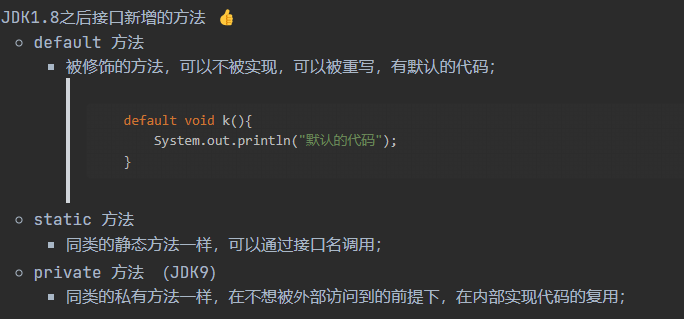
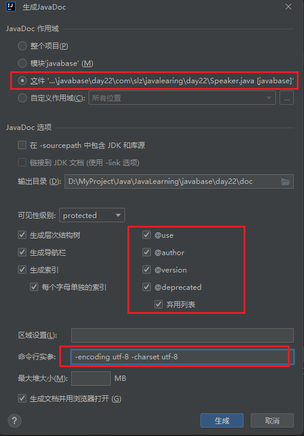
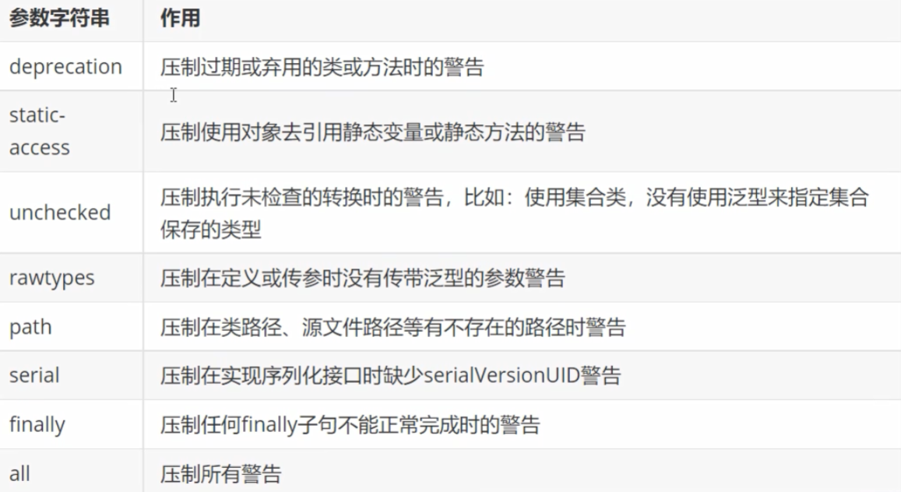

# 1. Map

存储的是 键/值 对的对象组; 不是Collection接口的子接口，本身是一个顶级接口。

- HashMap
  -------

  - 默认空间大小是16，负载因子动态扩容；
  - 特性：无序性、key唯一性、value不唯一性；
  - 采用hash算法存储数据, key不可以重复，value可以重复;
  - 如果发生了重复的key, 则后放入的会覆盖先放入的数据;
  - 常用方法：
    - containsKey(key): 判断map中是否包含指定的键，返回boolea类型；
    - containsValue(value): 判断map中是否包含指定的值，返回boolea类型；
    - remove(key): 按指定key将元素从map中移除；
    - remove(key,value): 按指定的key和value将元素从map中移除；
    - size(): 获取有效元素个数；
    - isEmpty(): 判断是否为空；
    - put(key,value): 放入元素；
    - get(key): 根据key获取元素相应值；
    - putAll(map): 放入map中所有元素；
    - replace(key,value): 将指定的key以给定value进行替换处理；
    - 高效的遍历方式：

```java
public class TestMap {
    public static void main(String[] args) {
        Map<String, Integer> map1 = new HashMap<>();
        map1.put("张三", 14);
        map1.put("李四", 15);
        map1.put("王五", 16);
        Map<String, Integer> map2 = new HashMap<>();
        map2.put("赵六", 13);
        map2.put("李四", 20);
        map2.put("钱八", 22);
        map1.putAll(map2);

        Set<Map.Entry<String, Integer>> entrys = map1.entrySet();
        for (Map.Entry<String, Integer> entry : entrys) {
            System.out.println(entry.getKey() + "\t" + entry.getValue());
        }
    }
}
```

- LinkedHashMap
  -------------

  - 继承自HashMap，有顺序；
  - 特性：有序性、key唯一性、value不唯一性；
- TreeMap
  -------

  - 底层采用树结构；
  - 不管放入时候的顺序，会按照Key升序排列；
- HashTable
  ---------

  - 都是实现 Map 接口；
  - HashTable 是基于陈旧的 Dictionary 类的，在jdk1.0时加入。HashMap是jdk1.2时加入的; 👍
  - HashTable 是线程安全的，HashMap是非线程安全的； 👍❤️
  - HashMap 可以将 null 作为 key 或者 value，而 HashTable 不允许 key 或 value 为 nul l值；👍❤️
  - HashMap 的初始容量16，Hashtable 初始容量为11，加载因子都是0.75；
  - HashMap 扩容时是 `capacity x 2`，Hashtable扩容是 `capacity x 2 + 1`；
  - HashMap 数据结构: 数组 + 链表 + 红黑树(当链表长度大于8时，转换为红黑树的结构); Hashtable数据
    结构: 数组+链表； ❤️
  - 计算 hash 的方法不同, Hashtable 计算直接使用key的 hashcode 对 table 数组的长度进行取模 HashMap 计算 hash对 key 的 hashcode 进行了二次 hash，以获得更好的散列值，然后再对 table 数组长度取模；

```java
public class TestTreeMap {
    public static void main(String[] args) {
        Map<Integer, String> map1 = new TreeMap<>(); // 键以树存储，使按键有序
        map1.put(22, "张三");
        map1.put(15, "李四");
        map1.put(18, "王五");
        Set<Map.Entry<Integer, String>> entrySet = map1.entrySet();
        for (Map.Entry<Integer, String> integerStringEntry : entrySet) {
            System.out.println(integerStringEntry.getKey() + "\t" + integerStringEntry.getValue());
        }
    }
}
public class TestLinkedHashMap {
    public static void main(String[] args) {
        Map<String, Integer> map1 = new LinkedHashMap<>(); // 按放入顺序存放（链表）和遍历访问
        map1.put("张三", 14);
        map1.put("李四", 15);
        map1.put("王五", 16);
        Set<Map.Entry<String, Integer>> entrySet = map1.entrySet();
        for (Map.Entry<String, Integer> entry : entrySet) {
            System.out.println(entry.getKey() + "\t" + entry.getValue());
        }
    }
}
public class TestHashTable {
    public static void main(String[] args) {
        Hashtable<String, Integer> hashtable = new Hashtable<>(); // 键值都不能为空
//        hashtable.put(null, 13);
//        hashtable.put("abc", null);

        Map<String, Integer> map = new HashMap<>(); // 键值都可以为空
        map.put(null, null);
    }
}
```

# 2. Properties 类



> 按照以上配置，支持中文;

- Properties 类继承自 HashTable;
- 用于属性配置文件`.properties`的处理，避免硬编码（使用软编码）方式；
- application.properites  与 application.yml 的优先级 boostrap.properties 优先级;
- 中文使用 unicode 编码方式；
- `.properties`文件的另一种处理方式是使用 ResourceBundle 类；

方式一：

```java
public class TestProperties {
    public static void main(String[] args) throws IOException {
        Properties properties = new Properties();
        properties.load(TestProperties.class.getClassLoader().getResourceAsStream("test.properties"));
        System.out.println(properties.getProperty("username"));
        Set<Map.Entry<Object, Object>> entrySet = properties.entrySet();
        for (Map.Entry<Object, Object> entry : entrySet) {
            System.out.println(entry.getKey());
            System.out.println(entry.getValue());
        }
    }
}
```

方式二：

```java
public class TestResourceBundle {
    public static void main(String[] args) {
        ResourceBundle bundle = ResourceBundle.getBundle("test"); // 只写文件名，不写扩展名
        System.out.println(bundle.getString("username"));
        System.out.println(bundle.getString("password"));
    }
}
```

# 3. Stack 栈

> 栈是限制线性表中元素的插入和删除只能在线性表的同一端进行的一种特殊线性表。允许插入和删除数据的一端，也就是变化的一端，称为栈顶(TOP)，另外一端为固定的一端，称为栈底(BOTTOM)。

- 后进先出(LIFO)的原则(先进后出(FILO))，最先入栈的元素在栈底，最后进入的元素在栈顶，而取出元素时正好相反，最后入栈的元素最先取出，最先入栈的元素最后取出；
- 压栈: 栈的插入操作，也叫作进栈/压栈/入栈；
- 出栈: 栈的删除操作， 也叫作出栈，也叫作弹栈；
- Stack 继承自 Vector，Vector 实现了 List 接口；Vector 是 ArrayList 的线程安全类，底层实现也是数组；
- 常用方法：
  - push(E): 压栈操作；
  - pop(): 从栈顶获取一个元素并将这个元素移除；
  - peek(): 从栈顶获取一个元素，不会移除这个元素；
  - isEmpty() / empty(): 判断当前栈是否没有元素;
  - search(Object): 查找一个元素在栈中的位置，如果没有找到，返回-1;

```java
public class TestStack {
    public static void main(String[] args) {
        Stack<Integer> stack = new Stack<>();
        stack.push(1); // 压栈
        stack.push(2);
        stack.push(3);
        stack.push(4);
        System.out.println(stack);
        System.out.println(stack.search(3)); // 查找元素，返回所在位置
        System.out.println(stack.search(5));
        System.out.println(stack.size());
        while (!stack.isEmpty() || !stack.empty()){ // 判断是否为空
            System.out.println(stack.pop()); // 出战
        }
    }
}
```

# 4. 队列

> 队列简称队，是一种操作受限的线性表，只允许在表的一端进行插入，在表的另一端进行删除。向队列中插入元素称为入队或进队，删除元素称为出队或离队。队头:(Front)，允许删除的一端，也称为队首。队尾:(Rear)，允许插入的一端。

- 操作特性是先进先出(FIFO)；
- 队列可以分为单向队列，双向队列；
- 还可以按阻塞情况分成阻塞队列，非阻塞队列；
- 还可以按是否有界分为有界队列，无界队列；

##### Queue

- 是一个接口，单向队列，继承自 Collection 接口；
- 除了基本的集合接口操作之外，队列还提供了特殊的插入、获取和移除的操作。这些操作都存在两种方法的形式，一种操作失败时抛出异常，另一种返回null或false；
- LinkedList 实现了 Deque 接口, Deque 继承自 Queue 接口, 基于链表实现; 👍
- LinkedList 实现了 Deque 接口, Deque 继承自 Queue 接口, 基于链表实现; 👍



```java
public class TestQueue {
    public static void main(String[] args) {
        Queue<Integer> queue1 = new LinkedList<>(); // LinkedList 实现了 Deque 接口, Deque 继承自 Queue 接口, 基于链表实现;
        Queue<Integer> queue2 = new ArrayDeque<>(); // ArrayDeque 实现了 Deque 接口, Deque 继承自 Queue 接口, 基于数组实现;
        queue2.add(1); // 向队列中添加元素，
        queue2.offer(2); // 向队列中添加元素，
    }
}
```

##### Deque

- 是一个接口，双向队列，继承自Queue;
- 具有先进先出或后进先出的特点，支持所有元素在头部、尾部进行插入、删除、获取；



❤️ 在使用到栈的结构时，推荐使用Deque，而不是Stack: ❤️ 

- Deque是接口，Stack是类，针对接口编程，不针对具体实现编程，接口可以屏蔽实现细节;
- Stack是继承自 Vector，使用 synchronized 实现线程安全

```java
public class TestDeque {
    public static void main(String[] args) {
        Deque<Integer> deque1 = new ArrayDeque<>();
        Deque<Integer> deque2 = new LinkedList<>();
        deque2.add(1);
        deque2.addLast(2);
        deque2.addFirst(3);
        System.out.println(deque2);
    }
}
```
