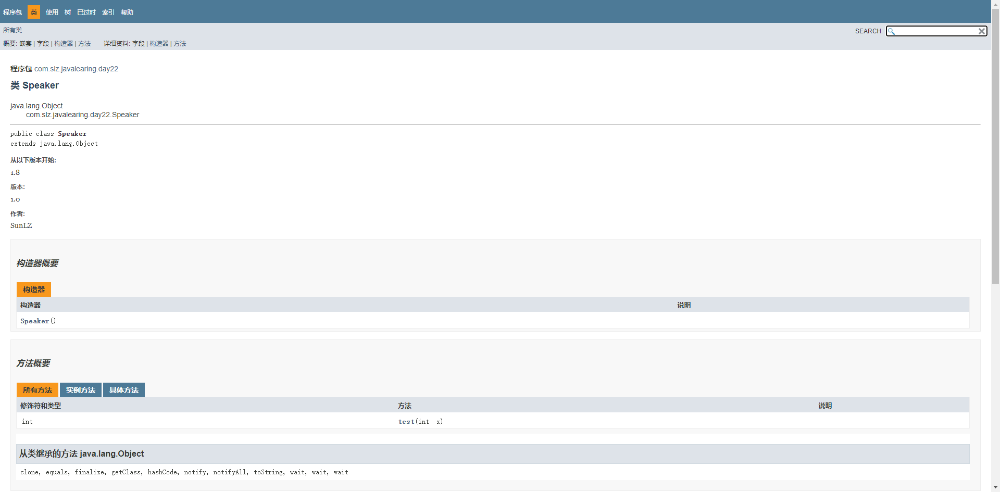

# lambda 表达式

### 1. 介绍

> lambda 表达式是 java8 中一个重要的特性，允许通过表达式来代替功能接口。lambda 和方法一样，提供了一个正常的参数列表和一个使用这些参数的主体, 主体可以是一个表达式或一个代码块)。lambda 可以看作是一个匿名内部类的语法糖，也可以称为闭包。

- 优点：代码简洁，开发迅速，方便函数式编程，过滤和计算非常容易，改善了集合类的操作；
- 缺点：代码可读性差，不太容易调试，在非并行计算未必有传统的for循环性能高；

### 2. 语法

> - `(参数)->表达式`
> - `(参数)->{语句块;}`

有三个部分组成：

- 参数：类似方法中的形参列表。这里的参数是接口里的参数，可以明确声明，也可以不声明类型，由JVM进行推断；
- -> : 可翻译为"被用于..."；
- 方法体: 可以是表达式，也可以是代码块。代码块可以返回一个值，也可以不返回值，这里的代码块相等于对接口实现的方法体。

### 3. 函数式接口 ❤️

> - 定义: 一个接口有且只有一个抽象方法;
> - `@FunctionalInterface` : 函数式接口注解，检查是否是函数式接口;
>
> 

```java
@FunctionalInterface // 函数式接口注解，检查是否是函数式接口
public interface MathInterface {
    Integer expend10(Integer i);
//    Integer abs(Integer i); // 一个函数式接口，有且只有一个抽象方法
    default Integer abs(Integer i){
        return Math.abs(i);
    }
}
public class TestLambda {
    public static void main(String[] args) {
        MathInterface mathInterface = new MathInterface() { // 1. 匿名内部类方式实现函数功能
            @Override
            public Integer expend10(Integer i) {
                return i*10;
            }
        };
        System.out.println(mathInterface.expend10(10));
        MathInterface mathInterface1 = (i) -> {return i*10;}; // 2. lambda 表达式实现函数功能
        MathInterface mathInterface2 = i -> i*10;             // 2. lambda 表达式实现函数功能
        System.out.println(mathInterface1.expend10(10));
        System.out.println(mathInterface2.expend10(10));
    }
}
```

### 4. Lambda 表达式使用

```java
public class Test {
    public static void main(String[] args) {
        // 1. 无参（小括号不能省略），无返回值，只有一行语句（大括号可以省略）
        MyInter myInter = ()-> System.out.println("test");
        // 2. 无参（小括号不能省略），无返回值，有多行语句（大括号不能省略）
        MyInter1 myInter1 = ()->{
            System.out.println("test1");
            System.out.println("test2");
        };
        // 3. 有一个参数（小括号可以省略），无返回值，只有一行语句（大括号可以省略）
        MyInter2<Integer> myInter2 = i -> System.out.println("test" + i);
        // 4. 有一个参数（小括号可以省略），有返回值，只有一行语句（大括号可以省略）, 省略大括号的同时，return 语句也要省略掉
        MyInter3 myInter3 = x -> Math.abs(x);
        // 5. 有多个参数（小括号不可以省略），有返回值，有多行语句（大括号不能省略）
        MyInter4 myInter4 = (x, y) -> {
            int sum = 0;
            sum = (int) Math.pow(x, y);
            return sum;
        };
//        MyInter4 myInter5 = (x, y) -> (int) Math.pow(x, y);
    }
}
interface MyInter {
    void test(); // 无参，无返回值
}
interface MyInter1{
    void test(); // 无参，无返回值
}
interface MyInter2<T>{
    void test(T t); // 有一个参数，无返回值
}
interface MyInter3{
    Integer abs(Integer x); // 有一个参数，有返回值
}
interface MyInter4{
    int pow(int x, int y); // 有两个参数，有返回值
}
```

### 5. JDK 内置的4个函数式接口


- 其它函数式接口



```java
public class TestFunctionInterface {
    public static void main(String[] args) {
//        Consumer<Integer> consumer = x -> System.out.println(x);
//        consumer.accept(123);
        test1(123, x-> System.out.println("获得" + x + "元")); // 1. 消费型接口
        test2(()->{                                              // 2. 供给型接口
            StringBuilder sb = new StringBuilder();
            String pattern = "abcdefghijklmnopqrstuvwxyz0123456789";
            Random random = new Random();
            for(int i=0; i<5; i++){
                sb.append(pattern.charAt(Math.abs(random.nextInt()) % pattern.length()));
            }
            System.out.println("验证码: " + sb.toString());
            return sb.toString();
        });
        System.out.println(test3(10, x->x*x));                  // 3. 函数型接口
        System.out.println(test4(100, x->x>0));                 // 4. 断言型接口
    }
    public static void test1(Integer x, Consumer<Integer> consumer){ // 函数式接口作为形参
        consumer.accept(x);
    }
    public static void test2(Supplier<String> supplier){ // 函数式接口作为形参
        supplier.get();
    }
    public static Integer test3(Integer x, Function<Integer, Integer> function){ // 函数式接口作为形参
        return function.apply(x);
    }
    public static boolean test4(Integer x, Predicate<Integer> predicate){ // 函数式接口作为形参
        return predicate.test(x);
    }
}
```

### 6. 方法引用

> 方法引用: 如果lambda表达式体中的功能 有方法已经实现了，则可以使用方法引用；
>
> lambda 表达式体中调用方法的参数列表和返回值类型，要和函数式接口中定义的抽象方法参数列表和返回值一致。

语法格式：

- 静态方法引用: `类名::静态方法名`;
- 实例方法引用: `实例对象名::实例方法名`;
- 特殊方法引用: `类名::实例方法名`;
- 构造方法引用: `类名::new`； 调用的构造方法的参数列表和函数式接口中抽象方法的参数列表一致

```java
public class TestFuncRef { // 测试方法引用
    public static void main(String[] args) {
        List<Integer> list = Arrays.asList(5, 3, 4, 6, 2, 8, 1);
//        list.sort(new Comparator<Integer>() {
//            @Override
//            public int compare(Integer o1, Integer o2) {
//                return Integer.compare(o1, o2);
//            }
//        });
//        list.sort((x, y) -> Integer.compare(x, y));
        list.sort(Integer::compare);                    // 1.1 静态方法引用
        System.out.println(list);
        Consumer<Integer> consumer = X::test;           // 1.2 静态方法引用
        consumer.accept(123);

        Supplier<Integer> supplier = new X()::test1;    // 2.1 实例方法引用
        System.out.println("随机数: " + supplier.get());
        list.forEach(System.out::println);              // 2.2 实例方法引用

        String s = "abc";
        Function<String, String> function = String::toUpperCase; // 3.1 特殊方法引用，类名引用实例方法
        System.out.println(function.apply(s));

        Supplier<X> supplier1 = X::new;                          // 4.1 构造方法引用
        System.out.println(supplier1.get());
        Function<String, X> function1 = X::new;                  // 4.2 构造方法引用
        System.out.println(function1.apply("sun"));
        BiFunction<String, Integer, X> biFunction = X::new;      // 4.3 构造方法引用
        System.out.println(biFunction.apply("li", 18));
    }
}

class X{
    public String name;
    public Integer age;

    public X() {
        System.out.println("无参构造");
    }

    public X(String name) {
        this.name = name;
        System.out.println("一个参数构造");
    }

    public X(String name, Integer age) {
        this.name = name;
        this.age = age;
        System.out.println("两个参数构造");
    }

    public static void test(Integer x){
        System.out.println("输出: " + x);
    }
    public int test1(){
        return new Random().nextInt();
    }

    @Override
    public String toString() {
        return "X{" +
                "name='" + name + '\'' +
                ", age=" + age +
                '}';
    }
}
```

> 简化流程：匿名内部类 -> lambda表达式 -> 方法引用；

### 7. 数组引用

> 数组类型[]::new

```java
public class TestNumsRef {
    public static void main(String[] args) {
//        Function<Integer, int[]> function = new Function<Integer, int[]>() {
//            @Override
//            public int[] apply(Integer integer) {
//                return new int[integer];
//            }
//        };
//        Function<Integer, int[]> function1 = x->new int[x];
        Function<Integer, int[]> function2 = int[]::new;
        System.out.println(function2.apply(3).length);
    }
}
```

### 8. this super方法引用方式

```java
public class TestThisSuper {
    public static void main(String[] args) {
        MyClass myClass = new MyClass();
        myClass.test2(123);
    }
    public void test(Integer x){
        System.out.println("消费了:" + x);
    }
    public void test1(Integer x){
        Consumer<Integer> consumer = this::test; // this 引用自身类的实例方法
        consumer.accept(x);
    }
}
class MyClass extends TestThisSuper{
    public void test2(Integer x){
        Consumer<Integer> consumer = super::test; // super 引用父类的实例方法
        consumer.accept(x);
    }
}
```

---


## ❤️ lambda 表达式引用外部定义的变量❤️

Lambda 表达式可以访问外部的final或effectively final变量。这意味着在lambda表达式外声明的变量，如果在其内部被引用，则该变量必须是不可更改的。这里的不可更改指的是在定义lambda之后，该变量的值不再改变。

> - ⭐️ final 变量：在Java 7及以前版本中，直接使用final修饰的变量可以被lambda表达式访问。
> - ⭐️ effectively final 变量：从Java 8开始，即便没有明确声明为final，只要在lambda表达式外部定义的变量在其赋值后不再有其他赋值操作，那么这个变量也被视为“有效地final”，可以在lambda表达式中使用。这意味着编译器会检查变量是否在赋值后不再改变，如果是，则允许在lambda中使用。👀️ 👀️ 👀️
