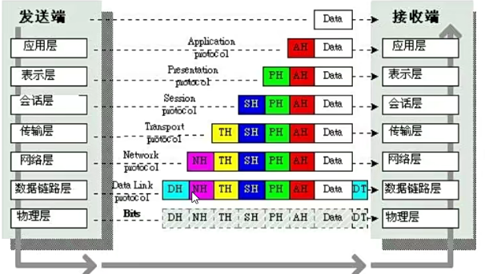
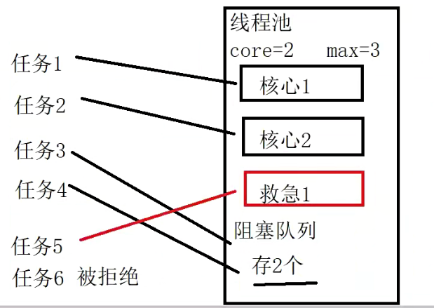
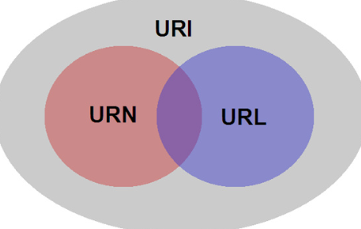
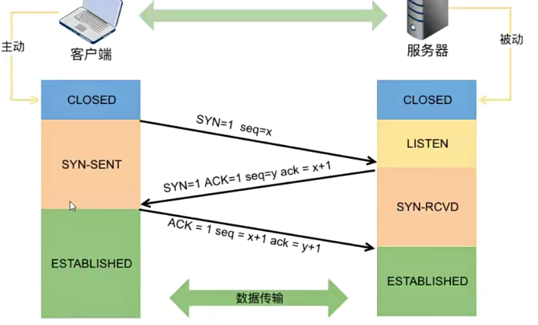

## 一、ReentrantLock

### 1. 介绍

- 是可重入的互斥锁，会比使用 synchronized 更加灵活，并且具有更多的方法；
- 底层基于Abstract Queued Synchronizer(AQS) 实现。AQS 是一个抽象同步队列器，作用是提供一个框架，简化程序员对锁同步控制工具的开开发；❤️
- 程序员只需要继承AQS类，实现 "尝试获取锁" 方法，实现 "尝试释放锁" 方法，就可以轻松实现可重入互斥锁；
- AQS 会把所有的请求线程构成一个同步队列，当一个线程执行完毕，会激活自己的后继节点。正在执行的线程并不在队列中，而等待执行的线程全部处于阻塞状态；
- ReentrantLock 实现了 Lock 接口，Lock 接口是 Java 中对锁操作行为的统一规范；

> ReentrantLock 其内部类继承关系；


### 2. 特点

- 支持可重入
- 可中断
- 可以设置超时时间
- 可以设置公平锁和非公平锁
- 支持多个条件变量，相当于有多个 waitset

#### (1) 可重入性

synchronized 和 ReentrantLock 都是可重入锁，可重入是指一个线程不用释放，可以重复的获取一个锁 n 次。

> 假设 t1 线程在上下文中获得了一个锁，当 t1 线程想要再次获取这个锁时，不会因为锁已经被自己占用而需要先等到锁的释放。

- synchronized: 无需释放锁，synchronized 会自动释放锁; ❤️
- ReentrantLock: 需要手动释放锁，加了几次锁，就需要释放几次; ❤️

##### 基本语法

> try{
>
> reentrantLock.lock(); // 加锁
> //...
>
> } finally {
>
> reentrantLock.unlock(); // 释放锁
>
> }

```java
public class TestReentrantLock {
    public static void main(String[] args) throws InterruptedException {
        ReentrantLock reentrantLock = new ReentrantLock();
        Thread t1 = new Thread(()->{
            int index = 1;
            try {
                reentrantLock.lock();
                System.out.println("---- 最开始加锁");
                while (true){
                    try {
                        reentrantLock.lock();
                        System.out.println("#### 第" + (++index) + "次加锁");
                        if (index==10){
                            break;
                        }
                    } finally {
                        reentrantLock.unlock();
                        System.out.println(">>>> 第" + (index) + "次解锁");
                    }
                }
            } finally {
//                reentrantLock.unlock();
                System.out.println("---- 最后解锁");
            }
        });
        t1.start();
        t1.join();
        System.out.println(reentrantLock.isLocked());
    }
}

```

#### (2) 可中断性

中断锁指的是锁在执行是，可以通过interrupt的通知，从而中断锁执行。

> 如果锁不可中断，可能会出现问题:当一个线程持有锁，出现异常时，只能一直阻塞等待;

- lockInterruptibly() : 可中断锁;

```java
public class TestLockInterruptibly {
    public static void main(String[] args) throws InterruptedException {
        ReentrantLock reentrantLock = new ReentrantLock();
        Thread t1 = new Thread(()->{
            try {
                System.out.println("t1 尝试获取锁");
                reentrantLock.lockInterruptibly(); // 可中断锁
                System.out.println("t1 获取到锁");
                TimeUnit.SECONDS.sleep(5);
            } catch (InterruptedException e) {
                System.out.println("t1 被中断");
                throw new RuntimeException(e);
            }finally {
                reentrantLock.unlock();
                System.out.println("t1 释放锁");
            }
        });
        Thread t2 = new Thread(()->{
            try{
                System.out.println("t2 尝试获取锁");
                reentrantLock.lockInterruptibly();
                System.out.println("t2 获取到锁");
            } catch (InterruptedException e) {
                System.out.println("t2 被中断");
                throw new RuntimeException(e);
            } finally {
                reentrantLock.unlock();
                System.out.println("t2 释放锁");
            }
        });
        t1.start();
        TimeUnit.SECONDS.sleep(1);
        t2.start();
        TimeUnit.SECONDS.sleep(1);
        if (t2.isAlive()){ // 由于t1一直持有锁，导致t1被阻塞，所以t2需要被打断
            t2.interrupt(); // 打断t2
        } else {
            System.out.println("t2 执行完成");
        }
        t1.join();
        t2.join();
        System.out.println(reentrantLock.isLocked()); // 查看锁是否被释放
    }
}
```

#### (3) ReentrantLock 设置超时时间

- reentrantLock.tryLock()：尝试获取锁。获取锁失败返回false，获取锁成功返回true，立即返回；
- reentrantLock.tryLock(3, TimeUnit.SECONDS)：尝试获取锁。最长等待3秒，获取锁失败返回false，获取锁成功返回true，3秒内返回；

```java
public class TestTryLock {
    public static void main(String[] args) throws InterruptedException {
        ReentrantLock reentrantLock = new ReentrantLock();
        Thread t1 = new Thread(()->{
           try{
               System.out.println("t1 尝试获取锁...");
               // 尝试获取锁。获取锁失败返回false，获取锁成功返回true，立即返回
               boolean b = reentrantLock.tryLock();
               if(!b){
                   System.out.println("t1 获取锁失败!");
                   return;
               }
               System.out.println("t1 获取到锁，开始执行...");
               TimeUnit.SECONDS.sleep(6);
           } catch (InterruptedException e) {
               throw new RuntimeException(e);
           } finally {
               reentrantLock.unlock();
               System.out.println("t1 释放锁");
           }
        });
        Thread t2 = new Thread(()->{
            try {
                System.out.println("t2 尝试获取锁...");
                // 尝试获取锁。最长等待3秒，获取锁失败返回false，获取锁成功返回true，3秒内返回
                boolean b = reentrantLock.tryLock(3, TimeUnit.SECONDS);
                if(!b){
                    System.out.println("t2 获取锁失败!");
                    return;
                }
                System.out.println("t2 获取到锁，开始执行...");

            } catch (InterruptedException e) {
                throw new RuntimeException(e);
            } finally {
                reentrantLock.unlock();
                System.out.println("t2 释放锁");
            }
        });
        t1.start();
        TimeUnit.SECONDS.sleep(1);
        t2.start();
        t1.join();
        t2.join();
        System.out.println(reentrantLock.isLocked());
    }
}
```

#### (4) ReentrantLock 设置公平锁与非公平锁 ❤️

公平锁:

> 多个线程按照申请锁的顺序去获得锁，线程会直接进入队列去排队，永远都是队列第一位可以获得锁；
>
> - 优点: 所有的线程都能得到资源，不会出现线程饥饿的问题。
> - 缺点: 吞吐量会下降很多，队列里面除了第一个线程，其他线程都会阻塞，cpu 唤醒阻塞线程的开销很大；

非公平锁:

> 多个线程去获取锁的时候，直接去尝试获取，获取不到再去进入等待队列，如果能获取到,就直接获取到锁。
>
> - 优点: 可以减少CPU唤醒线程的开锁，整体吞吐效率会提高，可以减少CPU唤醒线程的数量;
> - 缺点: 导致队列中有线程一直获取不到锁或者长时间获取不到锁，导致线程饥饿;

```java
public class TestFairAndUnfair {
    static class Data{
        int i= 0;
        ReentrantLock reentrantLock;

        public Data(ReentrantLock reentrantLock) {
            this.reentrantLock = reentrantLock;
        }
        void test(){
            while (i<=1000){
                try {
                    reentrantLock.lock();
                    i++;
                    System.out.println(Thread.currentThread().getName() + ":" + i);
                } finally {
                    reentrantLock.unlock();
                }
            }
        }
    }
    public static void main(String[] args) {
        ReentrantLock fairLock = new ReentrantLock(true); // 公平
        ReentrantLock unfairLock = new ReentrantLock(); // 非公平
        Data data = new Data(unfairLock);

        Thread t1 = new Thread(()->{
            data.test();
        }, "t1");
        Thread t2 = new Thread(()->{
            data.test();
        }, "t2");

        t1.start();
        t2.start();
    }
}
```

#### (5) Condition 多条件

> Condition的作用和 wait\notify 相同，wait 和 notify 是和同步锁(synchronized)一起使用，Condition 是和重入锁 (ReetrantLock) 一起使用的。

通过 Lock 接口的 newConditon 创建一个可以与当前重入锁绑定的 Condition 的实例主要调用的方法:

- await: 会使线程进入等待,I同时释放锁，当其他线程使用 singal 方法的时候，线程会重新获得锁并继续执行;
- singal: 会唤醒一个正在等待的线程;
- singalAll: 会唤醒所有等待的线程;

```java
public class TestCondition {
    public static ReentrantLock reentrantLock = new ReentrantLock();
    public static Condition condition1 = reentrantLock.newCondition(); // 条件一等待集合
    public static Condition condition2 = reentrantLock.newCondition(); // 条件二等待集合
    public static Condition condition3 = reentrantLock.newCondition(); // 条件二等待集合
    public static void main(String[] args) throws InterruptedException {
        Thread t1 = new Thread(()->{
            try{
                System.out.println("t1 尝试获取锁...");
                reentrantLock.lock();
                System.out.println("t1 获取到锁");
                condition1.await(); // 等待条件一满足
                System.out.println("t1 条件1满足");
                condition2.await(); // 等待条件二满足
                System.out.println("t1 条件2满足");
                condition3.await(); // 等待条件三满足
                System.out.println("t1 条件3满足");
                System.out.println("t1 执行完成");

            } catch (InterruptedException e) {
                throw new RuntimeException(e);
            } finally {
                reentrantLock.unlock();
                System.out.println("t1 释放锁");
            }
        });
        Thread t2 = new Thread(()->{
            try{
                System.out.println("t2 尝试获取锁...");
                reentrantLock.lock();
                condition2.await();
                System.out.println("t2 获取到锁");
                System.out.println("t2 执行完成");
            } catch (InterruptedException e) {
                throw new RuntimeException(e);
            } finally {
                reentrantLock.unlock();
                System.out.println("t2 释放锁");
            }
        });

        t1.start();
        t2.start();
        TimeUnit.SECONDS.sleep(2);
        new Thread(()->{
            try{
                reentrantLock.lock(); // 获取到锁才能执行
                condition1.signal(); // 唤醒条件1中的等待线程
            } finally {
                reentrantLock.unlock();
            }
        }).start();
        TimeUnit.SECONDS.sleep(2);
        new Thread(()->{
            try{
                reentrantLock.lock(); // 获取到锁才能执行
                condition2.signalAll(); // 唤醒条件2中的所有等待线程
            } finally {
                reentrantLock.unlock();
            }
        }).start();
        TimeUnit.SECONDS.sleep(2);
        new Thread(()->{
            try{
                reentrantLock.lock(); // 获取到锁才能执行
                condition3.signal(); // 唤醒条件3中的等待线程
            } finally {
                reentrantLock.unlock();
            }
        }).start();
    }
}
```

## 二、线程池

### 1. 简介

- 创建线程和销毁线程的开销是较大的(手动去new Thread类)；
- 线程过多会带来调度开销，会影响整体性能；
- 线程池就是存放线程的池子，在其中存放了很多可以复用的线程；
- 可以使用线程池来维护多个线程，进行统一管理；

优势：

- 提高效率，创建好一定数量的线程放在线程池中，需要时，直接使用从池中取出，比需要时，创建一个线程对象要快；
- 减少创建和销毁线程的次数，每个工作线程都可以被重复利用，可以执行多个任务；
- 提升系统响应速度。假设创建线程时耗费时间为 t1,执行业务逻辑耗费时间 t2，销毁线程耗费时间 t3，使用线程池，就节省 t1 和 t3 的时间；、
- 实现对线程管理，每个java线程池都会保持一些基本的线程统计信息，对线程进行有效管理；


### 2. 线程池状态



### 3. 线程池构造方法

```java
        ThreadPoolExecutor executor = new ThreadPoolExecutor(2, 3, 60,
                TimeUnit.SECONDS, new LinkedBlockingDeque<>(2), threadFactory, new ThreadPoolExecutor.DiscardOldestPolicy());
```

```java
ThreadPoolExecutor executor = new ThreadPoolExecutor(int corePoolSize. int maximumPoolSize, long keepAliveTime, TimeUnit unit, BlockingQueue< Runnable> workQueue, ThreadFactory threadFactory, RejectedExecutionHandler handler);
```

> 参数含义：7 个 ❤️
>
> - int corePoolSize: 核心线程数(最多保留的线程数);
> - int maximumPoolSize: 线程池所能容纳的最大线程数，超过这个数的线程，就会被阻塞，当任务队列没有设置大小时，这个值无效;
> - long keepAliveTime: 非核心线程的闲置超时时间，超过这个时间，就会回收;
> - TimeUnit unit: keepAliveTime 的时间单位；
> - BlockingQueue< Runnable> workQueue: 阻塞队列；
> - ThreadFactory threadFactory: 线程工厂，可以为线程创建时起名;
> - RejectedExecutionHandler handler: 拒绝策略；
>   - 默认拒绝策略: AbortPolicy，抛出异常；❤️
>   - 放弃本次任务策略: DiscardPolicy，直接放弃任务的执行；
>   - 由调用者执行: CallerRunsPolicy，线程池不去执行本次任务，由线程池的调用者线程去执行；
>   - 取代最早任务执行: DiscardOldestPolicy, 放弃队列中最早（队头）的任务，本次任务放在队尾；

🔴 后两个参数可以缺省；

### 4. 工作流程

- 线程池中最开始没有线程，当任务提交给线程池，线程池会创建一个新的线程来执行任务当线程数达到 core 核心线程数，并且没有线程空闲，再加入的任务，会被加入到 queue 队列中排队直到有空闲线程去执行这个任务；
- 如果队列是有界队列，那任务超过队列大小，会创建 (maximumPoolSize-corePoolSize)个救急线程；
- 如果线程 maximumPoolSize 占满，且阻塞队列已满，仍然有新的任务进来，此时执行拒绝策略；



```java
public class TestThreadPoolExecutor {
    public static void main(String[] args) {
        ThreadFactoryImpl threadFactory = new ThreadFactoryImpl();
        // 核心线程数2个，最多3个，有1个救急线程
        ThreadPoolExecutor executor = new ThreadPoolExecutor(2, 3, 60,
                TimeUnit.SECONDS, new LinkedBlockingDeque<>(2), threadFactory, new ThreadPoolExecutor.DiscardOldestPolicy());
        threadFactory.setThreadName("线程1");
        executor.execute(()->{System.out.println("task 1: " + Thread.currentThread().getName());});
        threadFactory.setThreadName("线程2");
        executor.execute(()->{System.out.println("task 2: " + Thread.currentThread().getName());});
        threadFactory.setThreadName("线程3");
        executor.execute(()->{System.out.println("task 3: " + Thread.currentThread().getName());});
        threadFactory.setThreadName("线程4");
        executor.execute(()->{System.out.println("task 4: " + Thread.currentThread().getName());});
        threadFactory.setThreadName("线程5");
        executor.execute(()->{System.out.println("task 5: " + Thread.currentThread().getName());});
        threadFactory.setThreadName("线程6");
        executor.execute(()->{System.out.println("task 6: " + Thread.currentThread().getName());});

        executor.shutdown();
    }
}

class ThreadFactoryImpl implements ThreadFactory{
    private String threadName;

    public void setThreadName(String threadName) {
        this.threadName = threadName;
    }

    @Override
    public Thread newThread(Runnable r) {
        return new Thread(r, threadName);
    }
}
```

### 5. 通过工厂方式创建线程池

- Executor: 提供了 execute() 方法来执行已提交的 Runnable 目标实例；
- ExecutorService: 该接口继承于 Executor接口，java 异步目标任务的 "执行者服务接口"，对外提供异步任务接收服务；
- Executors: 静态工厂类，通过静态工厂方法返回 ExecutorService、ScheduledExecutorService 等线程池对象；

#### (1) 固定线程池 newFixedThreadPool

```java
ExecutorService executorService = Executors.newFixedThreadPool(3);
```



- 固定线程数: 核心线程数 和 最大线程数相同，没有救急线程，也不需要处理超时时间, 阻塞队列是没有界限的，可以放任意数量的任务;
- 如果线程没有达到固定数量，每次提交一个任务，就会创建一个新的线程，直到线程数达到线程池固定数量;
- 线程池大小一旦达到固定数量，就会保持不变，如果某个线程因为执行异常而结束，线程池会补充一个新线程;
- 在接收异步任务的执行目标实例时，如果池中所有线程都在繁忙状态，新任务就会进入阻塞队列中;

⭐️ 适用场景:

> - 适用于任务量已知，相对耗时的任务
> - CPU密集型任务

⭐️ 缺点:

> - 内部使用无界队列来存放排队任务，当大量任务超过线程池最大容量需要处理时，队列无限增大，使服务器资源迅速耗尽

```java
public class TestNewFixedThreadPool {
    public static void main(String[] args) {
        ExecutorService executorService = Executors.newFixedThreadPool(3); // 线程池最大只有三个线程执行，其它线程存放在无界的阻塞队列里等待执行
        for (int i = 0; i < 20; i++) {
            executorService.execute(new Thread(()->{
                System.out.println(Thread.currentThread().getName() + ": 执行任务");
            }));
        }
        executorService.shutdown();
    }
}
```

#### (2) 单线程化线程池 newSingleThreadPool

- 单线程化线程池中的任务是按照提交的次序依次执行;
- 只有一个线程，并且这个线程的存活时间是无限的;
- 当线程池中这个唯一线程繁忙时，新提交的任务实例就会进入到阻塞队列中，并且阻塞队列是无界的;

⭐️ 适用场景:

> 任务按照提交次序一个一个的逐个执行；

⭐️ 单线程化线程池和用户自定义创建的单线程区别: ❤️

> 用户创建一个单线程串行执行任务，如果任务执行失败而终止，则没有任何补救措施，而线程池的方式还会创建一个线程，保证池的正常工作。

⭐️ 单线程化线程池和固定线程线程池为1的有什么区别: ❤️

> - 单线程化线程个数始终为1，不能修改，使用了装饰器模式，只对外暴露了 ExecutorService接 口，不能再调用 ThreadPoolExecutor 中的方法 （不能强转为ThreadPoolExecutor）;
>
> ```java
> public static ExecutorService newSingleThreadExecutor() {
>         return new FinalizableDelegatedExecutorService
>             (new ThreadPoolExecutor(1, 1,
>                                     0L, TimeUnit.MILLISECONDS,
>                                     new LinkedBlockingQueue<Runnable>()));
>     }
> ```
>
> - 固定线程池初始时为1，可以修改，对外暴露了 ThreadPoolExecutor 对象，经过强制转换，可以调用 ThreadPoolExecutor 中的方法（可以强转为ThreadPoolExecutor）;
>
> ```java
> public static ExecutorService newFixedThreadPool(int nThreads) {
>         return new ThreadPoolExecutor(nThreads, nThreads,
>                                       0L, TimeUnit.MILLISECONDS,
>                                       new LinkedBlockingQueue<Runnable>());
>     }
> ```

```java
public class TestNewSingleThreadExecutor {
    public static Integer x = 0;
    public static void main(String[] args) {
        ExecutorService executorService = Executors.newSingleThreadExecutor(); // 单线程化线程池，最多只有一个线程工作，其它任务放在阻塞队列中，适用于任务按照提交次序一个一个的逐个执行
        for (int i = 0; i < 10; i++) {
            executorService.execute(()->{
                System.out.println(Thread.currentThread().getName() + ": 执行了任务" + x++);
            });
        }
        executorService.shutdown();
    }
}
```

#### (3) 可缓存线程池 newCachedThreadPool

```java
ExecutorService executorService = Executors.newCachedThreadPool();
 public static ExecutorService newCachedThreadPool() {
        return new ThreadPoolExecutor(0, Integer.MAX_VALUE,
                                      60L, TimeUnit.SECONDS,
                                      new SynchronousQueue<Runnable>());
    }
```

- 核心线程数是 0；
- 最大线程数是 Integer.MAX_VALUE，所有的线程都是救急线程，没有核心线程，救急线程可以按 Integer 最大值创建;
- 救急线程空闲生存时间是 60秒，超过 60秒就会回收空闲的线程；
- 阻塞队列使用了 SynchronousQueue，内部没有容器，一个线程，生产了产品，如果当前没有其他线程去消费这个产品，生产线程处于阻塞状态，等待另一个线程去做消费处理；

```java
public class TestSynchronousQueue {
    public static void main(String[] args) {
        SynchronousQueue<Integer> synchronousQueue = new SynchronousQueue<>();
            new Thread(()-> {
                for (int i = 0; i < 10; i++) {
                    try {
                        System.out.println("生产了: " + i);
                        synchronousQueue.put(i);
                    } catch (InterruptedException e) {
                        throw new RuntimeException(e);
                    }
                }
            }).start();
        new Thread(()-> {
            for (int i = 0; i < 10; i++) {
                try {
                    System.out.println("消费了: " + synchronousQueue.take());
                } catch (InterruptedException e) {
                    throw new RuntimeException(e);
                }
            }
        }).start();
    }
}
```

⭐️ 适用场景:

> 需要快速处理突发性强，耗时较短的任务场景;

⭐️ 缺点:

> 线程池没有最大线程数量限制，如果大量的异步任务执行目标同时提交，可能会造成因创建线程过多而导致资源耗尽;

```java
public class TestNewCachedThreadPool {
    public static void main(String[] args) throws InterruptedException {
        ExecutorService executorService = Executors.newCachedThreadPool(); // 可缓存线程池，没有最大线程数限制，没有核心线程，都是应急线程。60秒空闲后被销毁
        for (int i = 0; i < 50; i++) {
//            TimeUnit.SECONDS.sleep(1);
            int finalI = i;
            executorService.execute(()->{
                System.out.println(Thread.currentThread().getName() + ": 执行任务 " + finalI);
            });
        }
        executorService.shutdown();
    }
}
```

#### (4) 任务调度线程池 newScheduledThreadPool ❤️



基于线程池的定时任务类，每个调度任务都会分配到线程池中的一个线程去执行，多个任务并发执行，相互之间并不影响。👍

> - Timer单线程串行执行的，任务会有先后顺序
> - Timer & TimeTask 是串行化定时任务，一旦前面的任务异常，后面的任务就不会执行；

```java
public class TestScheduledThreadPool {
    public static void main(String[] args) throws InterruptedException {
//        serialSchedule(); // Timer 实现串行化定时任务
        concurrencySchedule(); // ScheduledExecutorService 并发执行定时任务
    }

    public static void serialSchedule() throws InterruptedException { // 串行化定时任务
        Timer timer = new Timer(); // 串行化定时任务
        TimerTask task1 = new TimerTask() {
            @Override
            public void run() {
                System.out.println("任务1执行");
                int x = 5 / 0; // 串行执行，一旦前面的任务异常停止掉，后面的任务就无法执行了
            }
        };
        TimerTask task2 = new TimerTask() {
            @Override
            public void run() {
                System.out.println("任务2执行");
            }
        };
        timer.schedule(task1,1000); // 延后1秒执行
        timer.schedule(task2,1000); // 延后1秒执行
        TimeUnit.SECONDS.sleep(2);
        timer.cancel();
    }
    public static void concurrencySchedule(){ // 并发定时任务
        ScheduledExecutorService scheduledExecutorService = Executors.newScheduledThreadPool(3);
        // 延迟执行
        scheduledExecutorService.schedule(()->{
            System.out.println("任务一执行...");
        }, 1, TimeUnit.SECONDS);
        scheduledExecutorService.schedule(()->{
            System.out.println("任务二执行...");
        }, 1, TimeUnit.SECONDS);
        // 反复执行
        scheduledExecutorService.scheduleAtFixedRate(()->{
            System.out.println("任务三执行...");
        }, 1, 2, TimeUnit.SECONDS); // 初始延迟一秒，每两秒执行一次
//        scheduledExecutorService.shutdown();
    }
}

```

### 6. 线程池其它 API

- void execute(Runnable command): 执行 Runnable 任务；
- < T> Future< T> submit (Callable<T>task): 提交任务，返回 Future，获取任务执行结果；
- < T> List<Future< T>> invokeAll(Collection<? extends Callable< T>> tasks): 提交集合中的所有任务；
- < T> T invokeAny(Collection<? extends Callable< T>> tasks) throws InterruptedException,ExecutionException: 提交集合中的所有任务，只要有一个任务执行完，将结果返回，其他任务不再执行；

```java
public class TestPoolAPI {
    public static void main(String[] args) throws ExecutionException, InterruptedException {
        ExecutorService executorService = Executors.newFixedThreadPool(3);
        List<Callable<Integer>> taskList = Arrays.asList(() -> {
            System.out.println("任务1执行...");
            Thread.sleep(1000);
            System.out.println("任务1执行完毕");
            return 1;
        }, () -> {
            System.out.println("任务2执行...");
            Thread.sleep(2000);
            System.out.println("任务2执行完毕");
            return 2;
        }, () -> {
            System.out.println("任务3执行...");
            Thread.sleep(500);
            System.out.println("任务3执行完毕");
            return 3;
        });
//        testSubmit(executorService);
//        testInvokeAll(executorService, taskList);
        testInvokeAny(executorService, taskList);
        Thread.sleep(5000);
        executorService.shutdown();
    }
    public static void testInvokeAny(ExecutorService executorService, List<Callable<Integer>> taskList) throws ExecutionException, InterruptedException {
        Integer integer = executorService.invokeAny(taskList); // 其中任意一个返回结果后, 其它线程结束执行
        System.out.println(integer);
    }
    public static void testInvokeAll(ExecutorService executorService, List<Callable<Integer>> taskList) throws InterruptedException {
        List<Future<Integer>> futures = executorService.invokeAll(taskList); // 等待所有任务执行完一起返回
        futures.forEach((x)->{
            try {
                System.out.println(x.get());
            } catch (InterruptedException | ExecutionException e) {
                throw new RuntimeException(e);
            }
        });
    }
    public static void testSubmit(ExecutorService executorService) throws ExecutionException, InterruptedException {
        Future<Integer> submit = executorService.submit(() -> {
            int sum = 0;
            for (int i = 1; i <= 100; i++) {
                sum += i;
            }
            return sum;
        });
        System.out.println(submit.get());
    }
}
```

> 线程池关闭API

- shutdown(): 将线程池状态设置为 SHUTDOWN,调用该方法，线程池不会立即停止运行。停止接收外部的提交任务，内部正在执行的任务和队列里等待的任务，会执行完成，才会真正停止;
- shutdowNow(): 将线程池状态设置为 STOP，先停止接收一切外部提交的任务。忽略队列里等待的任务，尝试将正在执行的线程 interrupt 中断，返回未执行的任务列表;
- awaitTermination(): 当前线程阻塞，直到等待所有已提交的任务(包括正在执行的和队列中的)执行完，或者等超时时间到，或者线程被中断，抛出 InterruptedException, 这个方法，会返回 boolean 类型的值，如果超时，会返回 false。如果shutdown请求后所有任务执行完毕，会返回 true;

### 7. LockSupport 中的 park 和 unpark

- 可以完成线程按顺序执行的功能，类似于 wait 和 notify;
- wait notify 和 notifyAll 必须配置 Object Monitor一起使用, 加锁;
- park 和 unpark 不需要，以线程为单位来实现和阻塞和唤醒;
- notify 只能随机唤醒一个等待线程，notifyAll 唤醒所有等待线程，不够精准。park 和 unpark 可以精准唤醒线程，并且可以先执行 unpark;

```java
public class TestParkUnpark {
    public static void main(String[] args) throws InterruptedException {
        Thread t1 = new Thread(() -> {
            LockSupport.park(); // 线程阻塞, 处于休眠状态, 直到许可证可用, 或者被中断
            System.out.println("t1 执行");
        });
        t1.start();
        Thread.sleep(1000);
        new Thread(()->{
            System.out.println("t2 执行");
            LockSupport.unpark(t1); // 唤醒特定线程, 解除该线程阻塞,如果该线程没有启动则无效
        }).start();
    }
}
```


---
